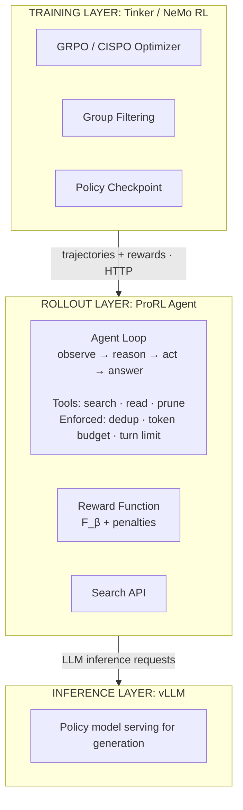

## The Setup

You have a corpus, a search API, and users asking questions that no single search query can answer in one shot. Your job is to design a system that learns to search well, not 
just retrieve, but *plan* what to search, *evaluate* what came back, *decide* whether to search again, and *manage* what stays in context.

The term "multi-hop search" covers two different skills:

**Type 1: questions whose constraints are bundled into the question text, sometimes explicitly tagged, sometimes encoded obliquely.** *"Find the EMNLP paper between 2018 and 
2023 where the first author did their undergrad at Dartmouth and the fourth at UPenn."* Constraints are explicit and tagged with field names; the agent has to parse them, 
issue searches for each, and combine results. Or in a harder form: *"A sacred structure in a western European capital was designed in a style combining two ancient 
architectural traditions, selected through a competitive process initiated in the late 1860s. The community for whom this building was constructed gained official state 
recognition during the early 1830s. On what date was this building formally inaugurated?"* Same skill (constraints are all in the question), but the constraints are encoded 
obliquely, the agent has to decode "competitive process initiated in the late 1860s" into something searchable.

**Type 2: vague natural-language questions that implicitly require multiple searches.** *"What's a cheap way to fly somewhere warm next month?"* The user didn't say "first 
determine warm destinations, then check flight prices." The agent has to generate that decomposition itself from a question that doesn't enumerate constraints.

This post is about Type 1. So is essentially every modern multi-hop search benchmark: BrowseComp, BrowseComp-Plus, FRAMES, HotpotQA, LongSeal, Seal-0. So is Context-1's 
training data. The skill being trained and evaluated is *parsing constraints that are already in the prompt and searching against each*, not *generating constraints from a 
vague question*. Type 2 is still mostly handled by base-model capability and the iterative search loop, not by direct training signal, because it's hard to construct a 
benchmark that scores Type 2 decomposition without subjective judgment.

If you're building an agent for a Type 1 surface (analyst tools where users naturally specify constraints; structured query interfaces; benchmark-style evaluation), the 
design choices below apply directly. If you're building for a Type 2 surface (consumer chat, ambiguous user questions, conversational search), the same machinery still helps 
but the problem is harder than what current benchmarks measure, and you're partly relying on emergent generalization from the base model.

Three parts: **The Agent** (the retrieval loop and runtime constraints), **The Policy** (how the model learns search strategy), and **The System** (how rollout and training 
scale). Chroma's Context-1 (released March 2026) is the running case study throughout, as the most complete public instantiation of the full stack.

---

# Part I: The Agent

## 1. The Baseline: Single-Pass Retrieval

The starting point everyone has. A query comes in, you embed it, retrieve the top-k chunks from your index, stuff them into the LLM's context window, and generate an answer. 
This is vanilla RAG, and for a significant class of questions it works well: direct factual lookups where a single chunk contains the answer and the user's query is close 
enough in embedding space to find it.

It breaks for the Type 1 questions we scoped above. Three specific ways:

**Multiple constraints don't fit one search.** Take the EMNLP paper question: *"Find the paper at EMNLP 2018-2023 where the first author did their undergrad at Dartmouth and 
the fourth at UPenn."* Embedding the whole question and retrieving top-k from a corpus of academic papers gets you nothing useful, the question's signal is spread across at 
least three orthogonal constraints (venue+year, first author's undergrad, fourth author's undergrad), and no single document contains all three. You need separate searches 
per constraint, then intersection.

**Constraint resolution requires iterative discovery.** Some constraints can only be resolved after others. To find the paper above, you might first need to search for "EMNLP 
papers 2018-2023 with Dartmouth-affiliated first authors," get back a candidate list, then for each candidate look up the fourth author's undergrad institution. The output of 
one search determines what to search for next. Single-pass retrieval cannot express this dependency.

**Scattered evidence.** The answer lives across multiple documents. No single chunk scores high enough on its own to land in the top-k, but together they form a complete 
answer. Increasing k doesn't reliably fix this. It brings in more noise alongside the signal.

There is a tempting non-solution: just retrieve more and use a larger context window. Chroma's Context Rot research measured what actually happens when you do this across 18 
frontier LLMs including GPT-4.1, Claude Sonnet 4.5, and Gemini 2.5. Adding irrelevant material forces the model to perform retrieval *and* reasoning simultaneously, and 
performance degrades. Longer context is not a substitute for better retrieval.

---

## 2. The Harness: Multi-Turn Search and Runtime Constraints

The fix for single-pass limitations is conceptually simple: put the LLM in a loop. The agent reads the user's question, formulates a search query, executes it against your 
API, inspects the results, and decides whether to search again with a refined query, read a specific document in full, or stop and synthesize an answer. This is the 
*observe-reason-act* pattern.

You define a tool interface: the contract between the model and your search infrastructure:

```
search(query: str, filters: dict) → List[Chunk]
read(doc_id: str) → str
grep(pattern: str, corpus: str) → List[Match]   # optional, for exact matching
```

The agent calls these tools in sequence. Each call's output becomes the next turn's observation. The model generates structured tool calls (typically JSON), a harness 
executes them, and the results get appended to the conversation. This continues until the model emits a final answer or hits a turn limit.

This loop solves all three problems from Section 1. Multi-hop queries become multi-turn conversations. Ambiguous queries get decomposed into concrete sub-queries across 
turns. Scattered evidence accumulates over multiple retrievals. The loop also introduces design decisions in the harness itself.

### Deduplication-Aware Retrieval

Semantically similar queries across turns retrieve the same chunks. The harness tracks every chunk ID returned in the trajectory and excludes them from subsequent search 
results.

### Token Budget Enforcement

Without a budget, the context window fills monotonically with accumulated retrievals. This is Context Rot happening within a single trajectory.

Cap the retrieved-context budget and add a **prune** action that lets the agent discard chunks to free budget. When the agent prunes, the harness removes the chunks from the 
model's view but keeps the full pre-prune trajectory in its own logs for reward computation.

Self-editing context is one of several approaches to the long-trajectory context problem. MemGPT pages data between fast in-context memory and slower external storage. ReSum 
periodically summarizes accumulated context into compressed form. Recursive Language Models treat the prompt as a variable in an external REPL. Summarization is lossy: 
fine-grained evidence gets compressed out. External memory adds infrastructure complexity. Self-editing via pruning preserves full document fidelity for everything retained, 
at the cost of forcing the agent to make irreversible discard decisions. Context-1 takes the self-editing route, arguing that for retrieval tasks, evidence fidelity matters 
more than compression ratio.

Context-1 (March 2026) instantiates these abstractions with a tight tool set:

| Tool | What it does |
| --- | --- |
| `search_corpus(query)` | Hybrid BM25 + dense retrieval, fused via reciprocal rank fusion. 50 candidates retrieved, reranked, top chunks returned up to a fixed token cap per 
call. |
| `grep_corpus(pattern)` | Regex search over the corpus, up to 5 matching chunks. |
| `read_document(doc_id)` | Pulls all chunks belonging to a document, reranks them against the current query, and returns as many top chunks as fit in the remaining 
trajectory budget. |
| `prune_chunks(chunk_ids)` | Removes specified chunks from the agent's view (not from the reward trajectory). |

The harness surfaces these constraints as first-class signals visible to the model. After every turn, the observation gets appended with current token usage, literally 
`[Token usage: 14,203/32,768]`. A soft threshold around 80% of budget triggers a harness-injected suggestion to prune or conclude. A hard cutoff rejects all tool calls except 
`prune_chunks` until space is freed.

Context-1's results include a relevant ablation: the same frontier models (Opus-4.5, GPT-5.2, Sonnet-4.5) run *without* the token budget and *without* the prune tool, given 
200k context, often score slightly higher on the paper's own benchmarks. This is a benchmark-metric artifact, not absence of Context Rot. The metric is retrieval recall; with 
no budget, frontier models issue more searches and recall climbs, even though reasoning over the bloated context is worse. On a benchmark scoring reasoning quality over the 
retrieved set (LongMemEval), the 200k-no-prune version would lose. Context-1's harness optimizes for one tradeoff: bound the context to keep reasoning quality high, accept 
fewer retrieval turns. Forced for a 20B model with a 32k window; suboptimal for a frontier model on a recall-weighted benchmark.

This harness-driven architecture is what most production agentic search systems run today. The harness is model-agnostic: swap the underlying LLM (GPT-4 to Claude to a local 
Qwen) without rewriting anything, because the harness owns the stateful logic (dedup, budgets, tool routing, result inspection) and the model just produces tool calls.

The limitation is that the harness shapes the *interface*; the base model provides the *policy*. Query decomposition, query reformulation, stopping decisions, exploration vs. 
exploitation tradeoffs are all bounded by the base model's pretrained zero-shot capability at those decisions. If the base is mediocre at decomposing multi-hop queries, 
prompt engineering can shift the distribution slightly but cannot teach it when enough evidence is enough. Specialized domain vocabulary (legal citations, internal product 
names, chemical nomenclature) defeats generic query habits regardless of how the tools are described. Pure-harness systems degrade sharply on domain-specific corpora, where 
the model has never learned how to use your search API's filters, facets, and ranking signals to their fullest. These are skills that come from training on outcomes in your 
environment, not from better instructions.

---

# Part II: The Policy

**Once you train a model with RL or SFT, the prompt template you trained with becomes part of the model.**

The fine-tuned model is fully promptable for *content*, the user's query, the corpus, the tool results, the conversation state. You change all of that freely at runtime.

The **template scaffolding** is locked in by training: system prompt phrasing, section delimiters and ordering, tool-call schema, output format conventions. Change the 
scaffolding at deployment and performance drops, often substantially.

This gives you three viable strategies, in increasing order of robustness and engineering effort:

- **Single fixed template.** Train with one prompt format, deploy with the exact same one. Highest peak performance on the trained template, zero robustness. The template 
ships as part of the model artifact, not as a runtime knob. This is what Context-1 does.
- **Multi-template training.** Sample from a small set of equivalent templates during data collection and RL rollouts. The model's performance becomes much flatter across the 
templates it saw during training: instead of peaking on one and dropping 30% on the others, all trained templates land within a few points of each other. Peak performance on 
any single template drops by a few points. Held-out templates the model never saw during training are *not* reliably handled by this alone. For that, you need the next 
option.
- **Contrastive regularization on top of multi-template training.** Add a regularization term to the RL loss that pulls the model's internal representations of the same 
content together across different templates. Without this, even multi-template training leaves the model's representations clustered by template rather than by content; the 
contrastive term is what actually breaks the clustering. Reported results match or exceed single-template peak performance while staying stable on held-out templates the 
model never saw at training time.

From Aissi et al. (2024), the contrastive term augments the PPO loss:

$$\mathcal{L}(\theta) = \mathcal{L}_{\text{PPO}}(\theta) + \alpha \cdot C(\theta)$$

$C(\theta)$ is a triplet margin loss over hidden states: anchor is $(\text{content}, \text{template}_i)$, positive is the same content under $\text{template}_j$, negative is 
different content under $\text{template}_i$. The triplets reuse the PPO rollouts, so the only added cost is one forward pass per alternate-template embedding ($\alpha = 0.5$ 
in the paper).

The embedding $z_\theta(p)$ is a single hidden-state vector from the running model, picked at one token and one layer. Layer 1 works best; deeper layers degrade 
monotonically. For encoder-decoder models the first token's layer-1 state already attends to the whole prompt and is used directly. For decoder-only models, a `<contrastive>` 
token is prepended at position 0 with bidirectional attention to the rest of the prompt, and its layer-1 state serves as the embedding.

The training templates must vary only formatting, ordering, delimiters, and phrasing, not fields, tools, or action semantics. The model becomes invariant to whatever axes you 
varied during training.

For the rest of Part II, assume single-template training (Context-1's choice).

---

## 1. Context-1's Synthetic Task Generation

Context-1's training tasks are, as the paper acknowledges, "needle-in-a-haystack style questions: multi-constraint queries designed to locate a single specific answer." Real 
search is "more abstract; the user does not specify every criterion needed to verify the final result." The format chosen here is what enables verifiable ground truth at 
scale; whether models trained on it generalize to truly underspecified queries is only tested in a limited way.

Within that scope, the structure matches the major public multi-hop benchmarks. The paper explicitly says: "We generate questions in the style of BrowseComp." Both formats 
bundle multiple constraints into the prompt; Context-1's clue paragraph just spreads constraints across more prose than BrowseComp's compressed single-sentence form.

The same synthetic dataset feeds both training stages: SFT runs an expert model on the tasks to generate trajectories, RL uses the tasks as queries for the training policy to 
roll out against.

### Input

The agent receives two things at inference time: a prompt and a corpus.

**Prompt.** A clue paragraph followed by the question. The clue paragraph contains several obfuscated factual references; the question is the actual ask, derivable only by 
resolving the clues and combining what they identify. The full prompt for one worked example from the paper:

```
A sacred structure in a western European capital was designed in
a style combining two ancient architectural traditions, selected
through a competitive process initiated in the late 1860s. The
community for whom this building was constructed gained official
state recognition during the early 1830s, shortly after their
nation achieved independence. Construction of this edifice was
completed during the same year a Belgian ocean liner was launched
from an English shipyard on the eve of winter solstice.

On what date was this building formally inaugurated?
```

No labels, no separators, no markers indicating where one obfuscated reference ends and the next begins. The agent receives a wall of constrained prose and has to recover the 
structure implicitly through search.

**Corpus.** What the agent searches over, accessed via the `search_corpus`, `grep_corpus`, and `read_document` tools. The corpus contains both supporting documents (which the 
agent should retrieve) and distractors (which it should reject), with no flag distinguishing them. Construction depends on the domain:

- **Web**: an explorer agent browses the web starting from a random Wikipedia seed topic, collecting documents containing unique facts.
- **Finance**: all SEC filings from a sampled set of public companies.
- **Legal**: USPTO patents and their cited prior art.
- **Email**: the Epstein email release (used because it post-dates training cutoffs of evaluated models) augmented with Enron emails (with names and dates swapped) as 
plausible filler.

### Label

A (supporting documents, answer) pair, used to score the agent's output. SFT uses the supporting document set to filter expert trajectories by recall (trajectories that 
didn't find these documents are downsampled). RL uses it to compute the $F_\beta$ reward in Section 4.

What makes the task multi-hop in practice is the *distractors*. The answer string sits somewhere in the corpus, sometimes in one document, sometimes in several (in the 
finance domain, the paper reports 67% of supporting facts appear across multiple chunks and documents). On its own that's not multi-hop: a single well-formed search could 
surface the answer-bearing document. The work comes from the corpus also containing distractors: documents that match a subset of the clues but lead to different answers 
(other Brussels synagogues, other 1878 buildings, other communities recognized in the 1830s). To rule them out, the agent has to cross-check candidates against the full clue 
set, which means finding the other supporting documents whose facts confirm or eliminate each candidate. Without distractors the multi-hop structure collapses into a single 
keyword search.

For the worked example, the label is:

- Supporting documents: *Grande Synagogue de Bruxelles*, *Belgian Jewish Community*, *SS Vaderland (1874)* (Wikipedia pages).
- Answer: *September 20, 1878*.

The Grande Synagogue page contains the date "20 September 1878" verbatim. A naive search for "Brussels synagogue inauguration" might surface it directly. The other supporting 
documents (the Belgian Jewish Community page, the SS Vaderland page) provide the cross-references the agent uses to reject distractors matching subsets of the clues. The 
paper allows the agent to terminate as soon as it surfaces the answer-bearing document.

### Distractors

Optional. Documents that satisfy some clue criteria but point to a wrong answer. They live in the corpus alongside supporting documents with no separating flag, so the agent 
has to recognize them as misleading from search results alone. Distractors are collected per-task in the web and email domains; for finance they emerge naturally from the 
company-scoped corpus, since the corpus already contains many filings unrelated to the specific question.

### Construction Pipeline

A task is built in five steps:

1. **Pick a seed and gather supporting documents.** Sample a starting point from the corpus (a Wikipedia topic for web, a company for finance, etc.) and select a small number 
of documents (typically 2-5) that share enough connective structure to support a multi-hop question.

2. **Generate the clues, question, and answer.** An LLM is prompted with the supporting documents and asked to produce: a clue paragraph that obfuscates facts spread across 
them, a question whose answer requires resolving those clues, and the ground-truth answer string.

3. **Verify by extraction.** Per supporting document:
   - First, an LLM extracts paired `(document_quote, clue_quote)` spans and flags whether the answer string appears in the document.
   - Second, code checks each `document_quote` is a real substring of the source.
   - Third, code checks the answer string was found in at least one document.
   - Tasks failing the second or third check are dropped.
   - Humans spot-check pair alignment on a sample; reported LLM-human agreement is >80% across all four domains (84.4% web, 93% finance, 98.3% legal, 87.5% email).

4. **Optionally collect distractors.** For domains where distractors don't emerge naturally from the corpus, the pipeline searches for additional documents that match some of 
the clues but lead to wrong answers. Each candidate distractor is run through an inverse check: an LLM extracts any occurrence of the answer in any form, and if it matches, 
the distractor is filtered out (it would have inadvertently contained the answer it was meant to mislead about).

5. **Optionally chain to add hops.** Take the answer of an existing task and bridge it to a new question whose answer is something the original answer leads to. A 1-hop task 
("X has property Y, what is Y?") becomes 2-hop when bridged ("the entity with property Y has property Z, what is Z?"). Iterating this produces tasks with controllable hop 
counts, used later by the difficulty curriculum at training time.

The extraction-based verification in step 3 is the load-bearing piece. Asking an LLM to score documents as "relevant" is unreliable; asking humans to read thousands of 
documents is unaffordable. Forcing the LLM to commit to a specific span makes the human side of verification cheap. The full pipeline is open-sourced as `context-1-data-gen`.


---

## 2. Adaptation Method: Full Fine-Tuning vs LoRA

Both SFT and RL below can be implemented with full fine-tuning or with parameter-efficient adaptation. The choice has compounding consequences.

**Full fine-tuning** updates every weight in the base model. Maximum policy expressivity, but the optimizer state for a 20B model is itself ~80GB at BF16 (Adam keeps two 
moment tensors per parameter), and gradient activations add more on top.

**LoRA (Low-Rank Adaptation)** freezes the base weights and trains only a small set of low-rank adapter matrices. For each targeted weight matrix $W \in \mathbb{R}^{d \times 
k}$, LoRA introduces a learnable delta $\Delta W = BA$ where $A \in \mathbb{R}^{r \times k}$, $B \in \mathbb{R}^{d \times r}$, with $r \ll \min(d, k)$. The forward pass 
becomes:

$$h = Wx + \frac{\alpha}{r} BAx$$

$W$ is frozen; only $A, B$ receive gradients. The factor $\alpha/r$ is a fixed scalar applied to the adapter output: $\alpha$ is a hyperparameter you pick before training, 
and dividing by $r$ keeps the adapter's effective strength stable when you change rank (without it, switching from $r=16$ to $r=64$ would also implicitly change the magnitude 
of $BA$, forcing you to retune learning rate). Tuning $\alpha$ is roughly equivalent to tuning the learning rate. At $r=16$ on a 4096×4096 matrix, the trainable parameter 
count drops to ~130K instead of ~16M, less than 1% of the original.

A reasonable LoRA config for a 20B reasoning model looks like:

- **Rank $r$**: 16-64. Lower rank means less expressivity but less risk of overfitting; higher rank approaches full fine-tuning but loses the capacity-preservation benefits. 
32 is a common default. The right value depends on how far the task distribution diverges from pretraining.
- **Alpha $\alpha$**: typically set equal to $r$ or $2r$. Effective scaling is $\alpha/r$, so $\alpha=2r$ doubles the adapter's contribution to the forward pass. With 
rank-stabilized LoRA (rsLoRA), the scaling becomes $\alpha/\sqrt{r}$, which makes higher ranks more stable.
- **Target modules**: which weight matrices get adapters. A transformer block has 7 linear (matrix-multiplication) layers in modern architectures: attention's $W_q, W_k, W_v, 
W_o$ projections plus the MLP's gate, up, and down projections. The original LoRA paper applied adapters to only $W_q, W_v$ (2 of the 7), prioritizing parameter efficiency. 
The QLoRA paper showed that targeting *all 7* yields meaningfully better adaptation, especially on hard tasks where MLP-level capacity matters. "Target-all-linear" is the 
modern default for RL on reasoning agents: every linear layer in every block gets an adapter. Embeddings, layer norms, and the LM head stay frozen.

LoRA's main tradeoffs vs full fine-tuning:

- **Forgets less of the base distribution.** The frozen base preserves whatever capability was there at the start. *LoRA Learns Less and Forgets Less* (Biderman et al., 2024) 
showed this empirically: LoRA underperforms full fine-tuning on continued pretraining for code and math, but at higher ranks closes most of the gap on instruction-following 
tasks while retaining substantially more source-domain capability.
- **Composes with quantization.** The base can be loaded in 4-bit (QLoRA) or MXFP4 while only the adapters are kept at higher precision for training. This is what makes 
20B-parameter RL training fit on modest hardware.
- **Caps how far the policy can drift between RL substeps.** A small adapter delta means $\pi_\theta$ stays closer to $\pi_{\theta_{\text{old}}}$ across the 4 substeps per 
rollout batch (Section 4), keeping the IS ratio closer to 1 and reducing the frequency of clip-firing. Synergistic with CISPO.
- **Constrains policy expressivity.** The adapter is rank-bounded, so policy changes that genuinely require high-rank weight deltas can't be expressed. For tasks that mostly 
need to reweight existing capabilities (like "use these specific tool-calling patterns more, this kind of pruning behavior more"), low rank suffices. For tasks that need 
fundamentally new circuits, it doesn't.

For Context-1 specifically, the paper says only that gpt-oss-20b was "adapted via a LoRA." Rank, alpha, target modules, and learning rate are all undisclosed, a real gap in 
published methodology since those choices materially affect reproducibility.

Assume LoRA-based adaptation for the rest of Part II. SFT trains LoRA adapters on expert traces, then RL further updates the same adapters.

---

## 3. Imitation: SFT on Expert Traces

The most natural training approach: generate good search trajectories, then supervise the model on them.

You take a strong model (a frontier reasoning model with good tool-use ability) and run it through your search environment on a diverse set of questions. For each question, 
the strong model executes the full observe-reason-act loop: formulating queries, inspecting results, reformulating, pruning, and producing an answer. You record the full 
trajectory: every tool call, every observation, every reasoning step.

Then you SFT your smaller, deployable model on these trajectories. The training signal is next-token prediction on the expert's actions given the trajectory history.

NVIDIA's NeMo Gym provides the environment layer: define your search task, wrap your API as a *resource server*, implement verification logic (did the agent find the right 
documents? did the answer match?), and NeMo Gym orchestrates rollout collection. Point it at a strong model via vLLM, run thousands of trajectories, and get structured data 
in the OpenAI Responses API format. From there: filter for high-reward trajectories, convert to SFT format, train with your preferred framework (NeMo RL, TRL, Unsloth). This 
is the first training stage in both NVIDIA's Nemotron family and Chroma's Context-1.

SFT learns the *surface pattern* of expert behavior, *what* the expert did, not *why*. If the expert issued `"Q2 revenue partnership impact"` and found the gold document, SFT 
trains the model to produce that exact query in similar contexts. `"partnership revenue Q2 effect"` or `"Q2 deal financial results"` would have worked equally well, 
retrieving the same document, but the model doesn't learn the equivalence.

This causes two measurable problems:

**In-domain ceiling.** The model is bounded by the expert traces; it cannot discover strategies the expert never demonstrated and inherits any suboptimalities in the expert's 
queries.

**Out-of-domain degradation.** SFT on agentic traces causes catastrophic forgetting: the model's performance on unrelated tasks (math, general reasoning, coding) degrades 
significantly. On the same training data, SFT often delivers in-domain improvement while RL retains substantially more out-of-domain capability.

The mechanism behind OOD degradation: SFT maximizes likelihood of the expert's *specific* tokens, shifting probability mass toward domain-specific phrasings and tool-call 
patterns, pulling mass *away* from the model's general capabilities.

SFT works as a warmup that grounds the model in task format and basic search behavior, but the in-domain ceiling and OOD degradation mean you want a second stage on top that 
learns from outcomes rather than imitation.

Context-1's SFT keeps both successful and unsuccessful rollouts. The motivation comes from *Shape of Thought*: trace distributional properties (well-formed tool calls, 
reasonable decompositions, sensible pruning) provide useful training signal independently of whether the expert reached the right answer. Expert trajectories are generated by 
running the full agent loop with Kimi K2.5 across ~8,000 synthetic tasks spanning four domains (web, finance, legal, email). The filtering rule:

- **High-recall trajectories** (>50% trajectory recall, >40% output recall) are kept.
- **Lower-recall trajectories** are kept at a diminishing rate based on how low the recall is.
- **Zero-recall trajectories** (expert never found the right documents) are kept at up to 5%, deduplicated by query. They get the same SFT treatment as everything else, 
next-token prediction on the expert's trajectory. They expose the model to long rollouts, the shape of how an expert handles a hard query, and cases where the correct 
behavior is to abstain rather than fabricate. Capping at 5% prevents the failure pattern from dominating.
- **Explored-well-but-concluded-poorly trajectories** (where trajectory recall substantially exceeds output recall: the expert found relevant docs during search but failed to 
include them in the final output set) are **excluded entirely**. Training on these would reinforce exactly the disconnect between exploration and selection that the eventual 
reward is designed to fix.

Then, when the same query produced multiple high-recall rollouts (because the expert model was run repeatedly on the same task), only one of those rollouts is kept. This 
prevents easy queries from being overrepresented in the high-recall slice, since they're the ones most likely to produce many successful rollouts. The lower-recall and 
zero-recall slices already have their own controls (diminishing-rate sampling and the 5% cap respectively), so this query-level dedup specifically targets the high-recall 
pool.

---

## 4. Outcomes: End-to-End RL and Reward Design

SFT gets the model into the task. RL is the second stage that pushes past the imitation ceiling: let the model explore different search strategies on its own, score each 
trajectory by whether it *actually worked* (did the agent find the right documents? did the final answer match?), and update the policy toward strategies that produce good 
outcomes regardless of whether they look like the expert's.

The model generates a complete search trajectory (the *rollout*), receives a scalar reward, and the policy is updated to increase the probability of actions that led to high 
reward and decrease the probability of actions that led to low reward.

A well-designed search agent reward has multiple components, each addressing a specific failure mode:

```
reward = (
    1.0 × answer_correct        # did the final answer match ground truth?
  + 0.4 × retrieval_ndcg@10     # were the retrieved docs relevant and well-ranked?
  + 0.2 × gold_doc_found        # did the trajectory surface the gold document at all?
  - 0.05 × extra_search_calls   # penalize unnecessary API calls
  - 0.1 × malformed_tool_calls  # penalize invalid JSON, bad filters, etc.
)
```

Each term exists for a specific reason, and removing any of them produces a specific failure mode:

**`answer_correct` alone is too sparse.** The model gets a binary signal at the very end of a 15-turn trajectory. It has no information about which search turns were good and 
which were wasted. Credit assignment across turns becomes nearly impossible with pure outcome reward.

**`retrieval_ndcg@10` provides dense signal on search quality.** This measures whether the agent's search strategy found relevant documents in a good ranking order, 
independent of whether the downstream answer model succeeded. It tells the model "your search was good" even when the answer model made an unrelated mistake.

**`gold_doc_found` is a trajectory-level recall signal.** Did the agent, at any point across all its search turns, surface a document containing the answer string? This is 
less sensitive to ranking quality than nDCG but catches the case where the right document appeared in turn 3 but was pruned by turn 10.

**The penalty terms enforce efficiency.** Without `extra_search_calls`, the model learns to issue 30 searches per question because more retrieval always has some positive 
expected value for the retrieval metrics. This is correct behavior *given the reward* but terrible in production where each search call costs latency and money. Without 
`malformed_tool_calls`, the model occasionally produces invalid tool calls that the harness silently drops. The model never learns the correct syntax because it's never 
explicitly punished for violations.

The training loop: GRPO (Group Relative Policy Optimization) via NeMo RL. The environment: NeMo Gym with your search API wrapped as a resource server. The flow per training 
step:

1. Sample a batch of questions from the training set
2. For each question, generate *G* rollouts (typically 8) with the current policy
3. Each rollout is a full multi-turn search trajectory executed against the real environment
4. Score each rollout with the reward function
5. Compute group-normalized advantages: a group is the *G* rollouts for one question. Subtract the group's mean reward and divide by its standard deviation. Each rollout's 
advantage now reflects how much better or worse it was than other attempts at the same question, not vs the full batch.
6. Update the policy with clipped importance-sampled gradients (GRPO/CISPO)

NeMo Gym handles steps 2-4. NeMo RL handles steps 5-6. vLLM serves the model for generation during rollout. The three components communicate through standardized interfaces, 
NeMo Gym's rollout format is the OpenAI Responses API schema, which NeMo RL consumes directly.

Search-R1, built on veRL, is another well-documented implementation of this exact pattern. It supports GRPO and PPO, multiple LLM backbones (Llama, Qwen), and both local 
retrievers (dense/sparse via Faiss + Pyserini) and online search APIs. For a quick prototype of the training loop, Search-R1 is arguably the fastest path to a working system.

Context-1's reward combines an outcome signal, a process component, a binary bonus, and penalties for degenerate behavior. Each term has a specific failure mode it exists to 
prevent.

**The outcome component is an $F_\beta$ score with $\beta=16$ at initialization.** $F_\beta$ is a generalization of $F_1$ that lets you weight recall against precision:

$$F_\beta = \frac{(1+\beta^2) \cdot \text{precision} \cdot \text{recall}}{\beta^2 \cdot \text{precision} + \text{recall}}$$

$\beta=1$ is standard $F_1$; $\beta>1$ weights recall more heavily; $\beta<1$ weights precision more heavily. The canonical interpretation (Van Rijsbergen 1979) is that 
$F_\beta$ measures retrieval effectiveness when recall is treated as $\beta$ times more important than precision. Context-1 initializes at $\beta=16$ because it's a retrieval 
subagent feeding a downstream answering model: missing a critical document is much worse than including an irrelevant one, since the downstream model can still filter noise 
but cannot recover information that was never retrieved.

**The process component is trajectory recall**, credit for *encountering* relevant documents during search regardless of whether they appear in the final output set. Without 
this term, the paper reports the agent converging to a degenerate strategy: issue one or two broad searches, terminate early, output whatever came back. Trajectory recall 
keeps exploration alive even when subsequent pruning decisions are imperfect (which is always, early in training). The harness-level choice from Section 2 of Part I, 
preserving the pre-prune trajectory for reward computation, is what makes this term computable: without that design, rewarding trajectory recall would mean rewarding the 
agent for not pruning.

**A binary +1.0 bonus fires when a chunk containing the actual answer is retrieved**, not just supporting documents. Without this, $F_\beta$ alone can incentivize agents to 
retrieve topically related documents that satisfy the clue constraints without locating the answer itself. The bonus makes the distinction explicit.

**Two degenerate-behavior penalties.** A repeated-pruning penalty (0.1 per excess call, capped at 0.5) kicks in for consecutive prune streaks longer than 3, preventing the 
agent from pruning one chunk at a time across many turns instead of batching. A turn-count penalty increases linearly from 0 at 64 turns to 0.5 at 128 turns, discouraging 
diminishing-returns search.

**Two curricula running in parallel.** First, a **reward curriculum**: the $\beta$ parameter in the $F_\beta$ score is annealed from 16 down to 4 across epochs, shifting the 
agent from recall-heavy broad exploration early to more selective precision late. Second, a **difficulty curriculum**: training tasks are labeled by number of hops required, 
and the question distribution shifts from low-hop early to multi-hop late. Exposing the model to 4-hop tasks before it can solve 1-hop tasks yields near-zero reward and no 
gradient signal.

**No downstream reasoning model in the reward loop.** An alternative reward would feed retrieved documents to a reasoning model and check whether the final answer is correct 
end-to-end. Context-1's authors reject this for two reasons. First, it confounds search quality with reasoning quality: if the downstream model fails, it's ambiguous whether 
the search agent retrieved insufficient evidence or the reasoning model failed to use what was provided. Second, it doubles cost: every rollout requires an additional LLM 
call per episode.

### CISPO Instead of GRPO

Context-1 uses CISPO (Clipped IS-weight Policy Optimization), introduced in the MiniMax-M1 paper and recommended by ScaleRL. The mechanical difference from GRPO is small but 
consequential.

**Notation.** $q$ is the prompt (question), $o_i$ is the $i$-th full response sampled from the policy for that prompt, $o_{i,t}$ is the $t$-th token within that response, and 
$o_{i,<t}$ is everything generated before it. So $\pi_\theta(o_{i,t} \mid q, o_{i,<t})$ is the policy's probability of the token at position $t$ given the prompt and the 
prefix so far. A "group" is the set of $G$ responses sampled from a single prompt.

**Importance sampling, briefly.** GRPO collects a batch of rollouts using the old policy $\pi_{\theta_{\text{old}}}$, then runs multiple *gradient substeps* on that same 
batch before re-rolling out. A substep is one gradient update; "4 substeps per step" means four parameter updates on the same set of trajectories. After substep 1, the 
current policy $\pi_\theta$ has already shifted from the policy that generated the rollouts, so substeps 2 onward are off-policy with respect to the rollout distribution. To 
correct for this drift, token-level updates are reweighted by the *importance sampling ratio*:

$$r_{i,t}(\theta) = \frac{\pi_\theta(o_{i,t} \mid q, o_{i,<t})}{\pi_{\theta_{\text{old}}}(o_{i,t} \mid q, o_{i,<t})}$$

This corrects for the distribution mismatch between rollout-time and update-time policies.

**Both algorithms clip the same thing.** Both GRPO and CISPO apply the clip operator to $r_{i,t}(\theta)$, the IS ratio. What differs is *how the clipped value participates 
in the loss*, and that determines whether clipping kills the gradient or just bounds it.

**GRPO's loss.** GRPO inherits PPO's per-token loss term, which is the minimum of an unclipped and a clipped version. The full objective is:

$$\mathcal{J}_{\text{GRPO}}(\theta) = \mathbb{E}_{q, \{o_i\}}\left[\frac{1}{|o_i|}\sum_{t=1}^{|o_i|} \min\big(r_{i,t}(\theta) \cdot \hat{A}_{i,t},\; 
\text{clip}(r_{i,t}(\theta), 1-\epsilon, 1+\epsilon) \cdot \hat{A}_{i,t}\big) - \beta D_{KL}(\pi_\theta \| \pi_{\text{ref}})\right]$$

with the group-relative advantage

$$\hat{A}_{i,t} = \frac{R_i - \text{mean}(\{R_j\}_{j=1}^G)}{\text{std}(\{R_j\}_{j=1}^G)}$$

computed across the $G$ rollouts in a group, and $D_{KL}$ a KL penalty against a reference policy. Focus on the per-token term inside the sum: $\min(r \cdot \hat{A},\; 
\text{clip}(r, 1-\epsilon, 1+\epsilon) \cdot \hat{A})$.

When $r$ falls outside $[1-\epsilon, 1+\epsilon]$ and the clipped branch becomes the active argument of the min, that token's contribution to the loss reduces to $(1 \pm 
\epsilon) \cdot \hat{A}_{i,t}$, a constant in $\theta$. Constant loss term → zero gradient → that token contributes nothing to the update.

**The failure mode.** For ordinary tokens with stable probabilities, $r$ stays near 1 and the clip rarely fires. But for *rare* tokens (low base probability, large 
probability change after one update) the ratio swings outside the clip range fast. The MiniMax-M1 authors observed this happening to tokens like "However," "Recheck," "Wait," 
"Aha", which serve as branch points in reasoning. After the first on-policy substep, those tokens were clipped and stayed gradient-dead for the remaining substeps in the 
batch.

**CISPO uses a different structural form.** Start from REINFORCE with importance-sampling correction for off-policy updates. The paper writes this as:

$$\mathcal{J}_{\text{REINFORCE}}(\theta) = \mathbb{E}\left[\frac{1}{|o_i|}\sum_t \text{sg}(r_{i,t}(\theta)) \cdot \hat{A}_{i,t} \cdot \log \pi_\theta(o_{i,t} \mid q, 
o_{i,<t})\right]$$

`sg` is the **stop-gradient** operator (`.detach()` in PyTorch). It returns its input's value during the forward pass but blocks gradient flow through it during backprop, so 
the term inside `sg` is treated as a constant for differentiation. Here it's wrapped around $r_{i,t}(\theta)$ because $r$ has $\theta$ in its numerator (through 
$\pi_\theta$); without `sg`, the policy gradient through $r$ would double-count alongside the gradient through $\log \pi_\theta$. With `sg`, the IS weight contributes only 
its numerical value as a scaling coefficient on top of the standard policy gradient $\nabla_\theta \log \pi_\theta$.

**CISPO's modification.** Same `clip(r)` operation, but used differently. Take REINFORCE's structural form above and substitute the clipped IS weight as the coefficient:

$$\mathcal{J}_{\text{CISPO}}(\theta) = \mathbb{E}\left[\frac{1}{\sum_i |o_i|} \sum_{i,t} \text{sg}(\hat{r}_{i,t}(\theta)) \cdot \hat{A}_{i,t} \cdot \log \pi_\theta(o_{i,t} 
\mid q, o_{i,<t})\right]$$

with

$$\hat{r}_{i,t}(\theta) = \text{clip}(r_{i,t}(\theta), 1-\epsilon^{IS}_{\text{low}}, 1+\epsilon^{IS}_{\text{high}})$$

**Why no token dies.** The structural difference from GRPO is that the gradient-bearing term is $\log \pi_\theta(o_{i,t})$, not $r$. The IS weight is a scalar multiplier 
*outside* the gradient. Clipping it shrinks the multiplier for outlier tokens (capping how much an unstable estimate can move the policy) but never zeros it: a clipped weight 
is still a real scalar that multiplies the live $\log \pi_\theta$ gradient. Every token contributes; the clip only controls *how much*.

Pruning decisions, query reformulations, and termination tokens are the rare-but-critical class that gets clipped under GRPO. Killing the gradient on these tokens compounds 
across training steps: the policy can't grow probability mass at branch points, so its output distribution gets progressively more peaked, and rollouts from the same prompt 
start converging toward identical trajectories. This is *entropy collapse*, and it's terminal for group-relative advantage: if all $G$ rollouts produce near-identical 
rewards, then $\hat{A}_{i,t} \approx 0$ across the board and the gradient vanishes everywhere. Training stalls.

Context-1's authors report CISPO as critical for preventing entropy collapse as training scaled. They tried Dr. GRPO's unbiased loss and DAPO's clip-higher variant first; 
CISPO was what held stability past ~200 training steps.

**Training schedule.** A *step* is one rollout-then-update iteration: generate 1,024 trajectories (128 queries × 8 rollouts each), then take 4 gradient *substeps* on that 
batch before discarding it and rolling out fresh. Each substep is one gradient update; substeps 2-4 are off-policy with respect to the rollout distribution and rely on the IS 
correction discussed above. The full run is 5 epochs over the training set, ~300 steps total, with convergence observed around step 230. The base model is gpt-oss-20b adapted 
via LoRA; full fine-tuning is avoided both to keep compute manageable and to preserve the base model's general capabilities.

**Group filtering.** Within a group of $G$ rollouts for the same query, if all $G$ receive identical rewards (all succeed, all fail), the group-normalized advantage is zero 
for every token in every rollout and the group contributes no gradient to the update. Context-1 detects and discards these groups before the loss computation, focusing the 
gradient on groups where some rollouts succeed and others fail.

---

# Part III: The System

## 1. Decoupled Rollout: ProRL Agent and Rollout-as-a-Service

ProRL Agent addresses the systems inefficiency that emerges when rollout and training fight for the same resources at scale.

Rollout is I/O-intensive: each search call hits a real API, document reads involve fetching and processing text, the agent might make 5-20 tool calls per trajectory, and each 
call blocks. Training is GPU-intensive: forward passes, backward passes, gradient synchronization. Running both in the same process guarantees each workload starves the 
other. ProRL Agent audited every major agentic RL framework (SkyRL, VeRL-Tool, Agent Lightning, rLLM, GEM) and found the same architectural decision: rollout embedded inside 
the training loop. The measured cost: GPU utilization stuck around 42% even with load balancing applied in isolation: each optimization component helps, but only the full decoupled architecture reaches 78%.

ProRL Agent separates them. The rollout system runs as a standalone HTTP service. The trainer sends a task instance (a question to answer). The rollout server handles 
everything: environment initialization, multi-turn agent execution, tool calls against the search API, reward computation. It returns a completed trajectory: the full 
sequence of states, actions, observations, and rewards.

The interface is a single HTTP endpoint:

```
POST /rollout
{
  "task": { "question": "...", "gold_docs": [...] },
  "policy_endpoint": "http://vllm-server:8000/v1/completions"
}

→ Response: {
  "trajectory": [...],
  "reward": 0.85,
  "metadata": { "turns": 7, "search_calls": 4 }
}
```

The trainer holds the policy and runs gradient updates; the rollout server runs vLLM for inference-only generation. After each training step (or every $N$ steps), the trainer 
pushes updated weights to the rollout server, which reloads them and resumes sampling. vLLM never sees gradients; it's a fast generator with a periodically-refreshed copy of 
the weights. The two services run on separate machines optimized for their respective workloads (inference-tuned hardware for the rollout fleet, training-tuned hardware for 
the trainer).

ProRL Agent reports GPU utilization of 78% with their full system; load balancing alone (without the decoupled rollout architecture) brings it to only 42%. Shell command latency drops from 0.78s to 0.42s per action with their 
bash optimizations. Throughput scales near-linearly with added compute nodes. The gains are largest for search agents because the workload is almost entirely I/O: in a 
decoupled architecture, the GPU processes gradient updates for already-completed trajectories while rollout servers collect new ones.

ProRL Agent is open-sourced and integrated into NeMo Gym. It supports both veRL and NeMo RL as training backends. The architecture has three components:

1. **Rollout server** (ProRL Agent): handles environment orchestration, tool execution, reward computation
2. **Trainer client** (NeMo RL or veRL): sends tasks, receives trajectories, runs gradient updates
3. **Inference server** (vLLM): serves the policy model for rollout generation. The trainer pushes updated weights to vLLM after each training step; vLLM never participates 
in gradient computation.

The rollout server implements hierarchical load balancing: LLM servers are assigned preferentially to rollout servers on the same physical node (reducing network latency), 
with remaining capacity distributed round-robin for global balance.

For a search agent specifically, your rollout server would wrap your search API as the environment's tool endpoint. Each rollout executes the full search loop: query, 
retrieve, inspect, reformulate, prune, answer. All against your actual search infrastructure. The reward function from Section 4 of Part II runs inside the rollout server. 
The trainer only sees completed trajectories and their rewards.

Context-1's training gives concrete numbers for what I/O-bound rollout looks like at production scale. A single training step produces 1,024 trajectories (128 queries × 8 
rollouts), each making multiple tool calls. This totals tens of thousands of search requests per step. Peak concurrency reaches **3,000+ queries per second** as environments 
cycle between model inference and tool execution.

To handle this load, each Chroma collection is replicated internally on Chroma Cloud, with each tool call randomly selecting a replica. The replication factor was chosen 
empirically to keep query latency manageable under peak rollout load. The paper reports *zero* failures from the search infrastructure during training: when rollout is 
designed as a separate, independently-scalable concern, it stops being a source of training instability.

Context-1 uses Tinker (Thinking Machines Lab's training infrastructure) rather than NeMo RL or veRL. The training-layer choice is interchangeable; the architectural lesson is 
that the rollout concern was handled by replicating the search infrastructure at the right factor and exposing it through tool endpoints, not by squeezing search serving into 
the training orchestrator.

---

## 2. The Full Stack: Results and Recipe

The full stack:



The pieces assembled into an ordered procedure:

1. **Synthetic tasks.** Build or generate a task set with verified ground truth. Context-1's extraction-based pipeline (Section 1 of Part II) is a reusable template: LLM 
extracts paired document/clue quotes, deterministic substring check, filter anything that fails verification. >80% human alignment without manual labeling.
2. **SFT data collection.** Run the full agent loop with a strong model as the inference backend, collecting complete trajectories. Filter for behavioral quality, not just 
final-answer correctness, include failed rollouts that are structurally well-formed, exclude rollouts where exploration succeeded but selection failed.
3. **SFT warmup.** Next-token prediction on the filtered trajectories. The goal is to ground the deployable model in tool-call format, parallel tool calling, query 
decomposition, and pruning behavior. A few epochs, don't overfit.
4. **RL with functional rewards.** GRPO or CISPO depending on your stability needs. Multi-component reward: outcome ($F_\beta$ with domain-appropriate recall bias), process 
(trajectory recall), binary bonus for the answer-containing chunk, penalties for degenerate behavior. Reward curriculum (anneal $\beta$ from high recall to balanced) and 
difficulty curriculum (chain tasks to scale hops).
5. **Group filtering.** Discard zero-variance groups before loss computation: the group-normalized advantage is zero everywhere, so they contribute no gradient.
6. **Evaluation.** Retrieval metrics (recall, F1, final-answer-found, trajectory recall vs. output recall gap) plus downstream integration test. Measure OOD retention on 
unrelated benchmarks to confirm general capabilities are preserved.
7. **Inference preparation.** Quantization-aware distillation on high-precision traces for production quantization (Context-1 uses MXFP4 for MoE layers). Serve via vLLM with 
streaming output.

Context-1's learned behavior, measured against its own base model:

| Metric | gpt-oss-20b (base) | Context-1 | Δ |
| --- | --- | --- | --- |
| Trajectory recall | 0.640 | 0.739 | +0.099 |
| Output recall | 0.361 | 0.641 | +0.280 |
| F1 | 0.307 | 0.487 | +0.180 |
| Final answer found | 0.541 | 0.798 | +0.257 |
| Prune accuracy | 0.824 | 0.941 | +0.117 |
| Parallel tool calls / turn | 1.52 | 2.56 | +1.04 |
| Turns / trajectory | 6.7 | 5.2 | –1.5 |

Output recall nearly doubles while F1 climbs by 0.18, the agent got better at *selecting* the right subset of what it found, not just at finding more. Parallel tool calling 
rises and trajectory length falls, the "same work done more efficiently" signature. Prune accuracy at 0.941 indicates the self-editing mechanism is being used correctly.

Against frontier models on the paper's generated benchmarks, Context-1 (1x) is competitive; Context-1 (4x), four independent rollouts fused via RRF, matches or comes close to Opus-4.5, GPT-5.2, and Sonnet-4.5 across the three trained domains:

| Model | Web | Finance | Legal |
| --- | --- | --- | --- |
| Context-1 (4x) | 0.97 | 0.95 | 0.98 |
| Context-1 (1x) | 0.88 | 0.89 | 0.92 |
| gpt-oss-20b (base) | 0.58 | 0.58 | 0.75 |
| opus-4.5 | 0.99 | 0.90 | 0.98 |
| gpt-5.2 | 0.95 | 0.92 | 0.93 |
| sonnet-4.5 | 0.97 | 0.92 | 0.98 |

Email is held-out: Context-1 was trained on web, finance, and legal data only, and the paper reports meaningful improvement over the base on email, evidence the learned search skills generalize beyond training distribution. This transfer continues on public benchmarks: Context-1 (4x) matches frontier models on BrowseComp-Plus (0.96), FRAMES (0.96), and HotpotQA (0.99), and is competitive on LongSeal (0.79) and Seal-0 (0.52). The four-rollout configuration runs in parallel and, given Context-1's per-call cost, remains cheaper than a single frontier-model call while matching frontier quality.

On inference: Context-1 is served on an NVIDIA B200 with MXFP4 quantization on the MoE layers, producing 400-500 tokens per second end-to-end. Up to 10× faster than the 
frontier models it matches on retrieval quality, at a fraction of the per-call cost.

---

## References

- **Chroma Context-1**: Bashir, Hong, Jiang, Shi. "Context-1: Training a Self-Editing Search Agent." Chroma Technical Report, March 2026. 
[trychroma.com/research/context-1](https://www.trychroma.com/research/context-1)
- **Context-1 data generation pipeline**: open-sourced at [github.com/chroma-core/context-1-data-gen](https://github.com/chroma-core/context-1-data-gen)
- **Context Rot**: Hong, Troynikov, Huber. "Context Rot: How Increasing Input Tokens Impacts LLM Performance." Chroma Technical Report, July 2025. 
[research.trychroma.com/context-rot](https://research.trychroma.com/context-rot)
- **ProRL Agent**: Zhang et al. "ProRL Agent: Rollout-as-a-Service for RL Training of Multi-Turn LLM Agents." arXiv:2603.18815, March 2026. 
[arxiv.org/abs/2603.18815](https://arxiv.org/abs/2603.18815)
- **MiniMax-M1 (CISPO)**: MiniMax. "MiniMax-M1: Scaling Test-Time Compute Efficiently with Lightning Attention." arXiv:2506.13585, June 2025. 
[arxiv.org/abs/2506.13585](https://arxiv.org/abs/2506.13585)
- **ScaleRL**: Khatri, Madaan, Tiwari, Bansal, Duvvuri, Zaheer, Dhillon, Brandfonbrener, Agarwal. "The Art of Scaling Reinforcement Learning Compute for LLMs." arXiv:2510.13786, October 2025. 
[arxiv.org/abs/2510.13786](https://arxiv.org/abs/2510.13786)
- **Search-R1**: Jin et al. "Search-R1: Training LLMs to Reason and Search." Built on veRL. 
[github.com/PeterGriffinJin/Search-R1](https://github.com/PeterGriffinJin/Search-R1)
- **NeMo Gym**: NVIDIA. Build RL environments for LLM training. [github.com/NVIDIA-NeMo/Gym](https://github.com/NVIDIA-NeMo/Gym)
- **NeMo RL**: NVIDIA. Scalable toolkit for efficient model reinforcement. [github.com/NVIDIA-NeMo/RL](https://github.com/NVIDIA-NeMo/RL)
- **Prompt Overfitting in Agentic RL**: Aissi, Romac, Carta et al. "Reinforcement Learning for Aligning Large Language Models Agents with Interactive Environments: 
Quantifying and Mitigating Prompt Overfitting." arXiv:2410.19920, October 2024. [arxiv.org/abs/2410.19920](https://arxiv.org/abs/2410.19920)
- **Shape of Thought**: Chandra, Agrawal, Hosseini, Fischmeister, Agarwal, Goyal, Courville. "Shape of Thought: When Distribution Matters More than Correctness in Reasoning Tasks." arXiv:2512.22255. 
[arxiv.org/abs/2512.22255](https://arxiv.org/abs/2512.22255)
- **LoRA (original)**: Hu, Shen, Wallis, Allen-Zhu, Li, Wang, Wang, Chen. "LoRA: Low-Rank Adaptation of Large Language Models." arXiv:2106.09685, June 2021. 
[arxiv.org/abs/2106.09685](https://arxiv.org/abs/2106.09685)
- **QLoRA**: Dettmers, Pagnoni, Holtzman, Zettlemoyer. "QLoRA: Efficient Finetuning of Quantized LLMs." arXiv:2305.14314, May 2023. 
[arxiv.org/abs/2305.14314](https://arxiv.org/abs/2305.14314)
- **LoRA Learns Less and Forgets Less**: Biderman, Portes, Ortiz, Paul, Greengard, Jennings, King, Havens, Chaudhary, Lialin, Schoelkopf, Kim, Frankle, Raff, Rush, Hadi 
Rajabi Sani, Cunningham. arXiv:2405.09673, May 2024. [arxiv.org/abs/2405.09673](https://arxiv.org/abs/2405.09673)
- **F-β score (Van Rijsbergen 1979)**: van Rijsbergen, C. J. *Information Retrieval*, 2nd ed. London: Butterworths, 1979. (Section 7, "Evaluation".)

---

## Citation

```
@misc{agentic-search-evolution-2026,
  author = {naskovai},
  title  = {From Single-Pass RAG to Self-Editing Search Agents: Designing and Training Agentic Search},
  year   = {2026},
  month  = {June},
}
```
