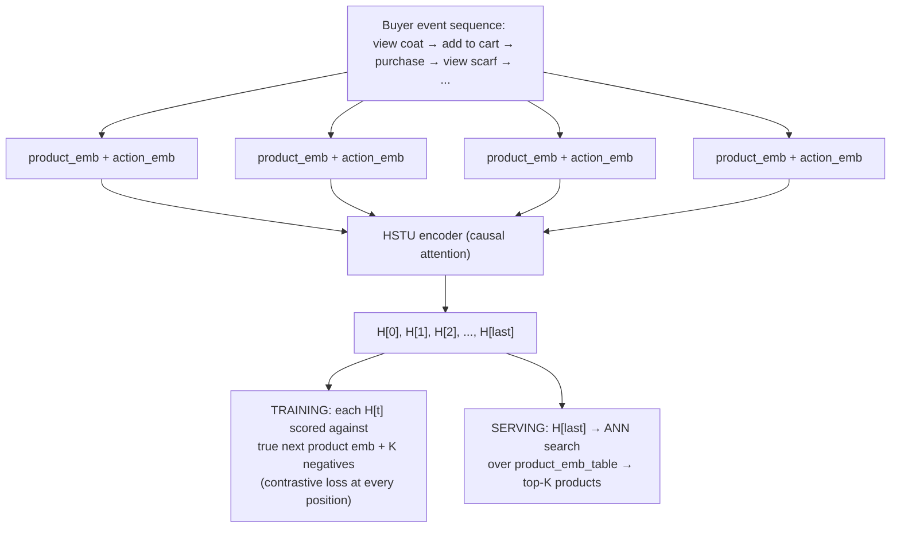
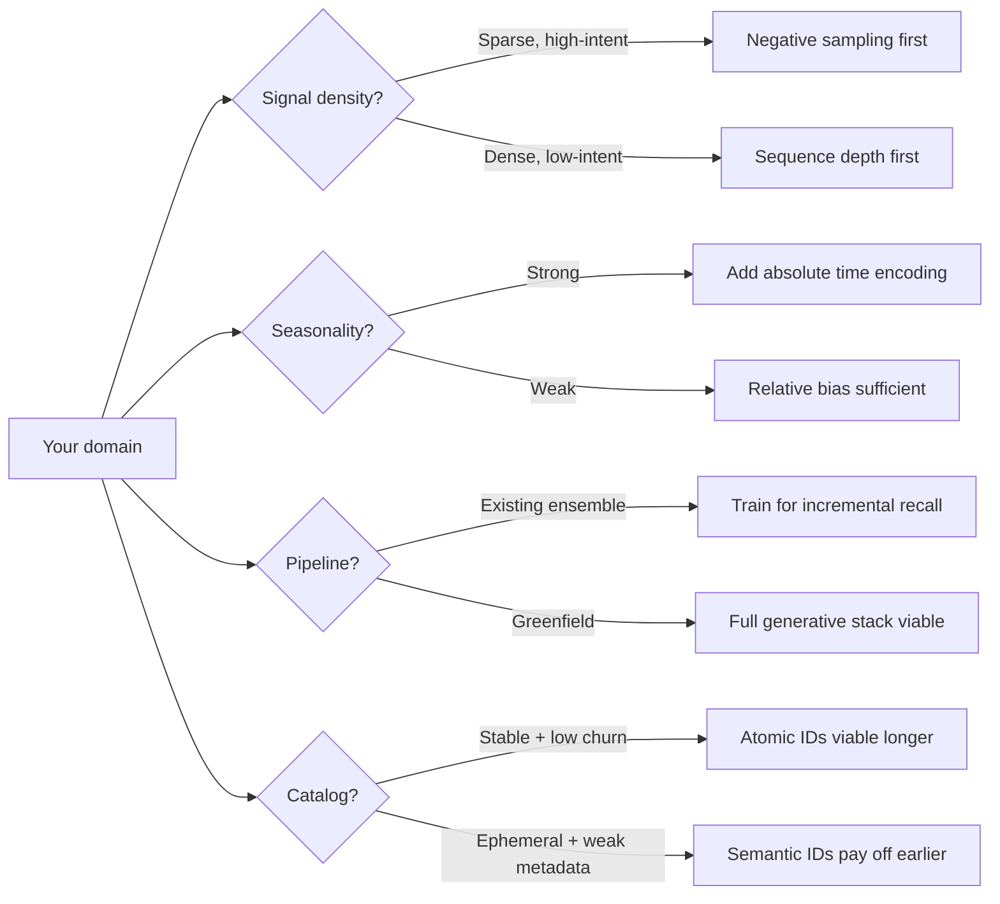

This is a companion to [Generative Recommendations: A Mechanistic Guide](/posts/generative-recsys-overview/), which described the full generative recsys stack from first principles: Semantic IDs, HSTU, alignment, list generation.

Shopify [published](https://shopify.engineering/generative-recommendations) the architecture behind their production generative recommender in February 2026. Their system is built on the same HSTU foundation covered in that guide, but the choices they made, what they adopted, what they skipped, what they invented, reveal which pieces matter most when your domain is commerce, your interaction signals are sparse and high-intent, and your model has to earn its place inside an existing retrieval ensemble. (If you haven't read the original guide, the sections on training like a language model, HSTU attention, and token construction are the most relevant background.)

---

## 1. Where Shopify Sits on the Architecture Map

The original guide went deep on Semantic IDs: RQ-VAE, codebook training, collaborative alignment, catalog lifecycle management. That entire discussion describes Shopify's *roadmap*, not their current system.

Shopify is running on atomic product IDs, not Semantic IDs. Their engineering blog describes semantic IDs as a direction they're exploring, not something they've shipped.

**What the model actually sees and does.** The original guide's generative retrieval path (beam search decoding Semantic ID codes one level at a time over a 256-token vocabulary) doesn't apply here. With atomic product IDs, the vocabulary *is* the full catalog: millions of products. You can't do a softmax over millions of IDs, and the model never tries to. Instead, the model is a causal Transformer that produces a dense vector at each position, and that vector is trained to be close (in dot-product space) to the embedding of whichever product comes next. The "prediction" is geometric: push the output vector toward the true next product's embedding and away from negatives' embeddings.

**Step 1: Build the input sequence.** Each event in the buyer's history becomes a dense vector from learned embedding tables. These are randomly initialized and trained with the model, the same way token embeddings work in an LLM. No pre-computed content features enter the model. The product's title, images, and metadata don't appear. The embedding for product #48201 starts as random noise and learns its meaning purely from how buyers interact with it across millions of sequences.

```
# Learned tables (randomly initialized, trained end-to-end with the model):
product_emb_table                                     # float32[num_products, d_model]  e.g. [5M, 256]
action_emb_table                                      # float32[num_actions, d_model]   e.g. [5, 256]

# Each event = product identity + what the buyer did
# (RoPE time encoding is applied inside attention, not here)
X[i] = product_emb_table[product_id[i]]               # float32[d_model]
     + action_emb_table[action_type[i]]                # "view", "add_to_cart", "purchase"

# Full input: n events
X                                                      # float32[n, d_model]
```

**Step 2: HSTU processes the sequence with causal attention.** Each position can see all previous positions but not future ones. The attention block uses pointwise SiLU (not softmax), RoPE on timestamps (Lesson 1), relative time bias, and gating instead of a feed-forward network. The original guide covers each of these in detail.

```
# One HSTU block (stacked L times with residual connections):
proj = silu(einsum('nd, dh -> nh', X, W_proj))         # float32[n, 4*d_attn]
Q, K, V, U = split(proj, 4, dim=-1)                    # each: float32[n, d_attn]

Q = apply_rope(Q, timestamps)                          # rotate by event timestamp
K = apply_rope(K, timestamps)                          # rotate by event timestamp

scores = einsum('ia, ja -> ij', Q, K)                  # float32[n, n]
       + pos_learned_weights[bucket(pos_dist)]            # relative position bias
       + time_learned_weights[bucket(time_dist)]          # relative time bias
weights = silu(scores)                                 # pointwise, NOT softmax
weights = causal_mask(weights)                         # zero out future positions

attn_out = einsum('ij, ja -> ia', weights, V)          # float32[n, d_attn]
gated = layer_norm(attn_out * U)                       # U gates each dimension (replaces FFN)
output = einsum('na, ad -> nd', gated, W_out)          # float32[n, d_model]
```

After stacking L layers with residual connections, the output H is `float32[n, d_model]`. H[t] encodes "everything this buyer did up to and including event t."

**Step 3: Training. Every position is a contrastive loss.** This is where the "generative" objective lives. At each position t, the hidden state H[t] is scored via dot product against the true next product's embedding and against K sampled negatives. The loss pushes H[t] closer to the true next product and farther from the negatives. A sequence of 500 events gives 499 such losses.

```
H_pred = H[:-1]                                        # float32[n-1, d_model]
target_embs = product_emb_table[product_ids[1:]]       # float32[n-1, d_model]
neg_embs = product_emb_table[sample(num_products, K)]  # float32[K, d_model]

pos_scores = einsum('td, td -> t', H_pred, target_embs)   # float32[n-1]
neg_scores = einsum('td, kd -> tk', H_pred, neg_embs)     # float32[n-1, K]

logits = concat(pos_scores.unsqueeze(-1), neg_scores, dim=-1)  # float32[n-1, K+1]
log_probs = logits - log(sum(exp(logits), dim=-1, keepdim=True))  # log-softmax
loss = -mean(log_probs[:, 0])                                     # scalar
```

This is mathematically a contrastive loss at every position. That's what Shopify's NeurIPS abstract means by "contrastive learning with hard negative sampling." But unlike a two-tower setup, there's a single model with a causal mask, and every position produces a training signal. The quality of the K sampled negatives directly controls how sharp the learned boundaries are (Lesson 2).

**Step 4: Serving. Last position → ANN search.** At inference, the buyer's sequence is processed once. The hidden state at the last position is the user representation. Score it against all products via approximate nearest neighbor search.

```
user_repr = H[-1]                                      # float32[d_model]
scores = einsum('d, pd -> p', user_repr, product_emb_table)  # float32[num_products]
top_k = topk(scores, k=100)                            # approximate via ANN in practice
```

This is the only moment the system looks like a two-tower retrieval model. During training, every position is a contrastive scoring task. During serving, you only read the last one.

The sequence is truncated to a fixed window (the HSTU paper uses 4096-8192 tokens at Meta; Shopify doesn't publish their number but mentions strict latency budgets). Events beyond the window are either dropped or compressed (the original guide covers compression strategies in detail).



This is a simpler setup than full generative retrieval, but it's the one most production systems actually run. Every design choice in this post, time encoding, negative sampling, ensemble training, operates within this framework.

Why is that a defensible choice? The "broken foundation" argument from the original guide, that atomic IDs have no structure and can't generalize, is real. But adopting Semantic IDs has significant operational cost, and Shopify's domain makes that cost harder to justify:

**Catalog churn is lower.** A short-video platform gets millions of new uploads daily, each needing immediate Semantic IDs. E-commerce catalogs change too, but the pace is slower and individual items are more stable once listed. This reduces the operational pain of codebook retraining cascades (the hardest part of the Semantic ID lifecycle, covered in the "Living with a changing catalog" subsection of the original guide).

**Cold start is partially addressed by existing systems.** New products with zero interaction history are common, and Semantic IDs' prefix-sharing would help. But new products in commerce arrive with structured metadata (brand, category, price point, description) that existing retrieval systems can already exploit for cold-start ranking without Semantic IDs.

The honest summary: Semantic IDs are a real improvement, but the operational complexity of maintaining codebooks, retraining downstream models when codes change, and managing the lifecycle is substantial. Shopify got strong results without them. The juice wasn't worth the squeeze yet.

So Shopify's architecture choice is: ship HSTU on product IDs, invest engineering effort in three targeted innovations on top of that foundation, and explore Semantic IDs as a future direction. Together, those innovations moved production metrics: a 0.94% lift in Shop orders, a 5% increase in high-quality click-through rate, and a 4.8% relative lift in final served recall. The rest of this post covers how.

---

## 2. Lesson 1. Time Means Something Different When Seasonality Is the Business

### What the original guide covers

The original guide describes HSTU's relative attention bias: log-bucketed time gaps added directly to attention scores. The model learns that "events 2 seconds apart are related" and "a month-long gap means a context switch." The mechanism:

```
# Positional bias: log-bucketed distance in sequence position
pos_gap = |position_j - position_i|                      # how many events apart
pos_bucket = floor(log(max(1, pos_gap)) / 0.301)         # ~25 buckets
positional_bias = pos_learned_weights[pos_bucket]         # float32[L, L], one scalar per bucket

# Temporal bias: log-bucketed distance in wall-clock time
time_gap = |t_j - t_i|                                   # seconds between events
time_bucket = floor(log(max(1, time_gap)) / 0.301)       # ~25 buckets
temporal_bias = time_learned_weights[time_bucket]         # float32[L, L], one scalar per bucket

scores = einsum('ia, ja -> ij', Q, K)                    # float32[L, L]
scores = scores + positional_bias + temporal_bias         # float32[L, L]
weights = silu(scores)                                    # float32[L, L]
```

This tells the model *how far apart* two events are. It can learn that recent events matter more than old ones, and that a session boundary (large time gap) resets context.

### What it can't do

Relative bias tells the model "these events are one month apart." It doesn't tell the model "it is currently December."

Those are different signals. In commerce, the second one often matters more than the first. A buyer who browsed winter coats in July was probably planning ahead; the same buyer browsing winter coats in November is shopping for this season. A buyer who looked at swimsuits three months ago in March was starting to think about summer; the same three-month gap in September means something entirely different.

You cannot recover seasonality from pairwise time gaps alone. If every pair of events has the same relative spacing, the model sees identical input regardless of whether the session is in June or December. The absolute anchor is missing.

### RoPE for timestamps: encoding "when" as rotation

The idea behind RoPE is a trick from complex numbers: **rotations encode position, and dot products automatically recover relative distance.** Let's build up to why.

**The geometric story.** Imagine each event in the buyer's sequence lives on a clock face. The event's timestamp determines its angle on the clock. Two events close in time point in similar directions. Two events far apart in time point in different directions. When the model computes attention (a dot product between two events), the dot product is largest when they point the same way (close in time) and smallest when they point in opposite directions (far apart).

That's the whole idea. The rest is mechanics.

**Step 1: Rotation in 2D.** Take a 2D vector $[x_1, x_2]$ and rotate it by angle $\theta$:

$$R(\theta) \begin{bmatrix} x_1 \\ x_2 \end{bmatrix} = \begin{bmatrix} x_1 \cos\theta - x_2 \sin\theta \\ x_1 \sin\theta + x_2 \cos\theta \end{bmatrix}$$

This is a pure rotation: it changes the *direction* of the vector but preserves its *length*. The vector still contains the same information. It's just been spun.

**Step 2: Encode timestamp as rotation angle.** For an event at timestamp $t$, set $\theta = t \cdot \omega$ where $\omega$ is a frequency. The rotation angle is proportional to time. An event at $t = 100$ seconds gets rotated by $100\omega$. An event at $t = 3{,}600$ seconds (one hour later) gets rotated by $3{,}600\omega$.

Apply this rotation to the query and key vectors before computing attention:

```
q_rotated = R(t_i · ω) · q_i     # rotate query by its timestamp
k_rotated = R(t_j · ω) · k_j     # rotate key by its timestamp
```

**Step 3: The dot product trick (why it works).** When we compute the attention score between two events, we take the dot product of their rotated vectors:

$$\text{score}(i, j) = q_{\text{rotated}}^T \cdot k_{\text{rotated}} = (R(t_i \omega) \cdot q_i)^T \cdot (R(t_j \omega) \cdot k_j)$$

Here's the key property of rotation matrices: $R(\alpha)^T = R(-\alpha)$. Transposing a rotation reverses it. So:

$$= q_i^T \cdot R(-t_i \omega) \cdot R(t_j \omega) \cdot k_j = q_i^T \cdot R\big((t_j - t_i)\omega\big) \cdot k_j$$

Two rotations composed give a single rotation by the *difference* of the angles. The absolute timestamps $t_i$ and $t_j$ vanish. Only the relative gap $(t_j - t_i)$ survives in the dot product.

The punchline: we encoded *absolute* timestamps (each event gets its own rotation angle), but the attention score depends only on the *relative* time gap between the two events. We get relative distance for free from absolute encoding, because composing two rotations gives a single rotation by the difference of the angles.

The absolute position information isn't lost. It's encoded in the rotation angle and available to the model. But the *attention pattern* (which events attend to which) automatically reflects relative timing, without any explicit subtraction or bucketing.

**Step 4: Multiple frequencies for multiple time scales.** One rotation frequency $\omega$ captures one time scale. But commerce needs many: seconds (within-session patterns), hours (time-of-day shopping behavior), days (weekday vs. weekend), months (seasonality).

RoPE handles this by pairing up dimensions of the embedding and assigning each pair a different frequency:

```
# d_model = 128 → 64 pairs of dimensions
# Each pair gets its own frequency

ω_0 = 1/1         # fast rotation:  captures fine-grained timing (seconds)
ω_1 = 1/10        # slower:         captures minutes
ω_2 = 1/100       # slower:         captures hours
...
ω_63 = 1/10^7     # slowest:        captures months/seasons

# For event at timestamp t, rotate each 2D pair by its frequency:
dims[0:2]   → rotated by t · ω_0     (responds to seconds)
dims[2:4]   → rotated by t · ω_1     (responds to minutes)
dims[4:6]   → rotated by t · ω_2     (responds to hours)
...
dims[126:128] → rotated by t · ω_63  (responds to seasons)
```

The fast-rotating pairs let the model distinguish "2 seconds ago" from "10 seconds ago." The slow-rotating pairs let the model distinguish "June" from "December." The dot product across all pairs combines signals from every time scale simultaneously.

**Step 5: Why this gives Shopify seasonality.** The slow-rotating dimension pairs are the key. Two sessions six months apart have their slow pairs pointing in nearly *opposite directions* (roughly half a rotation). Two sessions one year apart have their slow pairs pointing in nearly the *same direction* (the frequencies don't need to be tuned to exact annual periods. The model learns to use whatever periodic structure the frequencies provide). The model learns: "when slow pairs align with the 'December pattern,' upweight winter products."

At inference, Shopify injects the *current* session timestamp. That timestamp determines the rotation angles for this request. A June request and a December request produce different rotations in the slow pairs, which changes the attention scores, which changes which historical events the model considers relevant, which changes the recommendations. No rules. No seasonal features. Just geometry.

### The full picture: RoPE + relative bias together

Shopify uses both, and they're complementary. RoPE carries the seasonal signal (absolute calendar position via slow-frequency dimensions). The log-bucketed relative bias carries the recency signal (recent events get a boost regardless of calendar position). Combined:

```
scores = dot(R(t_i · ω) · q_i,  R(t_j · ω) · k_j)   # RoPE: absolute + relative
       + time_learned_weights[bucket(|t_j - t_i|)]        # bias: relative only
weights = silu(scores)
```

Together, they let the model answer both "how long ago was this event?" and "what time of year is it right now?" Those are the two temporal questions that matter most in commerce.

### Why this matters beyond Shopify

If your domain has strong seasonality, like fashion, food, travel, gifting, anything tied to weather or calendar events, relative time bias alone leaves signal on the table. The implementation cost of RoPE-for-timestamps is modest (it's the same math as standard RoPE, just applied to a different input), and it removes an entire category of manual feature engineering.

If your domain has weak seasonality, say a developer tools marketplace or a B2B SaaS recommender, relative bias is probably sufficient. The decision axis is: *does the same browsing behavior mean different things at different times of year?* If yes, you need an absolute time anchor.

---

## 3. Lesson 2. Negative Sampling Is the Primary Scaling Lever

### What the original guide skips

The original guide barely mentions negative sampling. Its training objective is next-token prediction over a vocabulary of 256 codes per level, where full softmax is feasible because the vocabulary is small. Shopify's setup is different: as described above, they train with sampled softmax over millions of atomic product IDs, scoring each hidden state against the true next product plus a batch of negatives.

This means the quality of the negative samples directly determines the quality of the learned representations. Shopify is explicit about this: they kept seeing the same pattern, as the number and quality of negatives improved, the model improved. They call it one of their most important levers.

### Why the negatives matter

Shopify describes two problems with naive uniform sampling, and two fixes.

**Easy negatives are uninformative.** If the negatives are too easy (Shopify's words), the model learns a weak representation. A random product from a catalog of millions is almost certainly irrelevant to the current user. The model gets no useful signal from correctly scoring "running socks higher than kitchen blender." It needs negatives that are hard to distinguish from the true positive, near-misses that force fine-grained distinctions.

**False negatives are catastrophic.** Sampling negatives uniformly from a large pool can treat potential true positives as negatives, which Shopify says "can catastrophically mislead contrastive learning." A product the user never saw isn't necessarily irrelevant, they might have bought it if it had been shown. Training the model to push away from that product corrupts the learned representation.

### Fix 1: Shared negatives

Share a single negative pool across the batch instead of sampling per-example. This expands the effective number of negatives each training example sees without proportionally increasing memory. The implementation is a single matrix multiply:

```
# query: float32[batch_size, d_model]     - each position's hidden state
# positives: float32[batch_size, d_model] - each position's true next product
# shared_neg: float32[K, d_model]         - shared negative pool

pos_scores = einsum('bd, bd -> b', query, positives)          # float32[batch_size]
neg_scores = einsum('bd, kd -> bk', query, shared_neg)        # float32[batch_size, K]
# One matmul scores all negatives for all positions simultaneously
```

Shopify notes that scaling negatives increases memory use, and that shared negatives let them increase coverage without exploding memory the way per-example negatives can.

### Fix 2: Positive-aware hard negatives

The second fix addresses the false negative problem. Shopify describes it this way: the most useful mistakes are usually near misses, but those near misses must be selected carefully to avoid false negatives that look incorrect only because the user never saw the item.

"Positive-aware" means the sampling procedure knows which items are true positives and avoids treating them as negatives. The resulting hard negatives are genuinely irrelevant products that happen to be similar to the user's interests, the most informative training signal because the model must learn subtle boundaries.

Shopify doesn't detail the exact mechanism for selecting hard negatives. They describe the principle (near misses, carefully selected to avoid false negatives) and the result (it was one of their most important levers).

---

## 4. Lesson 3. Train for the Ensemble, Not the Leaderboard

### The naive goal and why it fails

Most recommendation papers evaluate on recall@K: of the top $K$ items the model retrieves, how many are in the ground truth set? This is a clean metric for comparing models in isolation.

In production, isolation doesn't exist. Shopify's recommendation pipeline has multiple retrieval models generating candidates, rankers reordering them, and aggregation layers handling deduplication and diversity constraints. The generative recommender is one retriever among several.

This changes the optimization target fundamentally. A model with 60% recall@100 in isolation might add zero value to an ensemble that already achieves 58% recall@100, if the 60% and the 58% are the *same* 58 items, plus 2 new ones from the generative model that the other retrievers also found.

The metric that matters is *incremental recall*: how many true positives does this model find that the other retrievers in the ensemble miss?

### The boosting-inspired approach

Shopify addresses this directly in training. The mechanism borrows from gradient boosting: identify where the current ensemble is weakest and apply higher training pressure there.

In gradient boosting (XGBoost, LightGBM), each new tree focuses on the residuals, the examples the current ensemble gets wrong. The analogy for retrieval: each new model should focus on the *items* the current ensemble fails to retrieve.

Concretely, this means two things:

**Upweighting hard regions.** If the ensemble consistently fails to retrieve products in a certain part of the catalog (say, niche handmade goods from small merchants, or newly listed products without enough interaction signal for collaborative filtering), training examples involving those products receive higher weight. The generative model is pushed to become the specialist in exactly the regions where it can add incremental value.

**Treating other models' predictions as hard negatives.** This is the more interesting mechanism. If another retriever in the ensemble confidently predicts item $X$ for a given user, and $X$ is not a ground truth positive, then $X$ is a maximally informative hard negative for the generative model. Why? Because the ensemble already covers that prediction. Even if $X$ were a true positive, the ensemble would find it without the generative model's help. The generative model should learn to *disagree* with the ensemble where the ensemble is wrong, not to *agree* where the ensemble is already right.

```
# Conceptual training loop (simplified. In practice, missed items
# are upweighted rather than exclusive; you still train on some
# ensemble-covered positives for redundancy)
for user, true_positives in training_data:
    # What the existing ensemble retrieves for this user
    ensemble_preds = existing_ensemble.retrieve(user, k=100)
    
    # Items the ensemble misses. This is where we add value
    missed = true_positives - set(ensemble_preds)
    
    # Items the ensemble retrieves that aren't true positives. These are hard negatives
    ensemble_false_positives = set(ensemble_preds) - true_positives
    
    # Training signal: upweight missed items, use ensemble errors as hard negatives
    loss = compute_loss(
        model_output=model(user),
        positives=missed,                    # upweighted
        hard_negatives=ensemble_false_positives,  # from ensemble
        random_negatives=sample_random(catalog),
    )
```

This is simplified, but the principle is clear: the training objective isn't "predict what the user will engage with" in general. It's "predict what the user will engage with *that the ensemble would miss*."

### Online results

Shopify measures final served product recall: recall after the full ensemble plus ranker. Their online A/B test showed a 4.8% relative lift in final served recall@2, which translated to a 0.94% increase in Shop orders and a 5% increase in high-quality click-through rate.

### The lesson for system design

If you're adding a generative recommender to an existing pipeline, profile your ensemble's gaps first (per-category, per-segment, per-freshness recall), shape your training signal from those gaps, and track incremental recall ("new true positives this model adds") as a first-class metric. If your generative model perfectly agrees with collaborative filtering, it's redundant. The value comes from productive disagreement.

---

## 5. What Comes Next: The Semantic ID Horizon

As discussed above, Shopify is still on atomic product IDs: the operational cost of Semantic IDs wasn't justified by the marginal gain. But they're explicit about the direction: move from product ID space to token space through semantic IDs, then unify with text tokens.

The multimodal unification is the real prize. Once you have a shared token vocabulary for products and text, you can train a single model that handles both organic recommendations and search, with the user's query as additional sequence context. A buyer typing "gift for my dad who likes woodworking" becomes a text prefix that conditions the same autoregressive model generating product recommendations. That's the destination worth building toward. Not just better product IDs, but a unified sequence model over all commerce interactions.

What needs to be true for this to work: the codebook lifecycle problem (the "Living with a changing catalog" section of the original guide) is the hard engineering challenge, not the architecture. Shopify's journey from here to there is the classic gap between "the research works" and "the system is operationally ready."

---

## 6. The Pattern Behind the Three Lessons

Each of the three lessons is the same insight expressed at a different level of the system.

**Time encoding** is about the domain: the model doesn't exist in a vacuum. It exists in a commerce environment where December and June are fundamentally different contexts. Encoding absolute time makes the model domain-aware.

**Negative sampling** is about the training process: the model doesn't learn in a vacuum. It learns from the contrast between positives and negatives. The quality of that contrast, not the architecture, not the number of parameters, is the binding constraint on model quality at catalog scale.

**Ensemble training** is about the system: the model doesn't serve in a vacuum. It serves alongside other retrievers, and its value is defined by what it adds to the whole, not by what it achieves alone.

The common thread: optimizing the model in isolation, better architecture, longer sequences, more parameters, is the last thing you should do, not the first. The context the model lives in (the domain, the training distribution, the serving ensemble) determines the ceiling. Shopify's three innovations all raise that ceiling. The architecture was already good enough.

HSTU works. The Transformer backbone for sequential recommendation is mature enough that architecture changes yield diminishing returns relative to the surrounding system. The next wave of improvements comes from understanding the domain (time), the training dynamics (negatives), and the production context (ensembles), not from a better attention mechanism.

The shorthand for practitioners:



For teams building generative recommenders today: start with HSTU (or an equivalent sequence Transformer), then work outward. Encode your domain's temporal structure. Get negative sampling right. Train for marginal value within your pipeline. Those three investments will almost certainly outperform a better architecture on naive training with random negatives and isolated evaluation.

---

## References

### This series

- [Generative Recommendations: A Mechanistic Guide](/posts/generative-recsys-overview/). The companion post covering the full stack from first principles: Semantic IDs, RQ-VAE, HSTU, alignment, list generation, and production serving.
- [Negative Sampling in Embedding-Based Retrieval](/posts/negative-sampling-ebr-overview/). Deeper coverage of negative sampling strategies for retrieval. The negative sampling lesson above covers the commerce-specific angle; this post covers the general theory.

### Shopify

- [The generative recommender behind Shopify's commerce engine](https://shopify.engineering/generative-recommendations). Yang Liu and Ali Khanafer, Shopify Engineering, February 25, 2026. The primary source for this post.
- [Shopify's NeurIPS 2025 talk on generative recommendations](https://neurips.cc/virtual/2025/loc/san-diego/128667). Conference presentation covering earlier results from this work.

### Key papers

- Zhai et al., [Actions Speak Louder than Words: Trillion-Parameter Sequential Transducers for Generative Recommendations](https://arxiv.org/abs/2402.17152), ICML 2024. The HSTU paper. Introduces the architecture Shopify built on: pointwise SiLU attention, relative attention bias, gating, M-FALCON microbatched inference.
- Su et al., [RoFormer: Enhanced Transformer with Rotary Position Embedding](https://arxiv.org/abs/2104.09864), 2021. The original RoPE paper. Shopify's time encoding adapts this from token positions to timestamps.

---

## Citation

```bibtex
@misc{naskovai2026shopifyrecsys,
  author = {naskovai},
  title  = {Generative Recsys in Production: Three Lessons from Shopify's Commerce Engine},
  year   = {2026},
  url    = {https://naskovai.github.io/posts/generative-recsys-shopify/}
}
```
