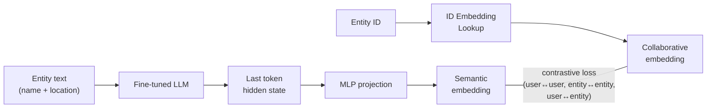
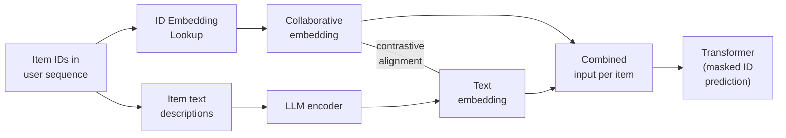
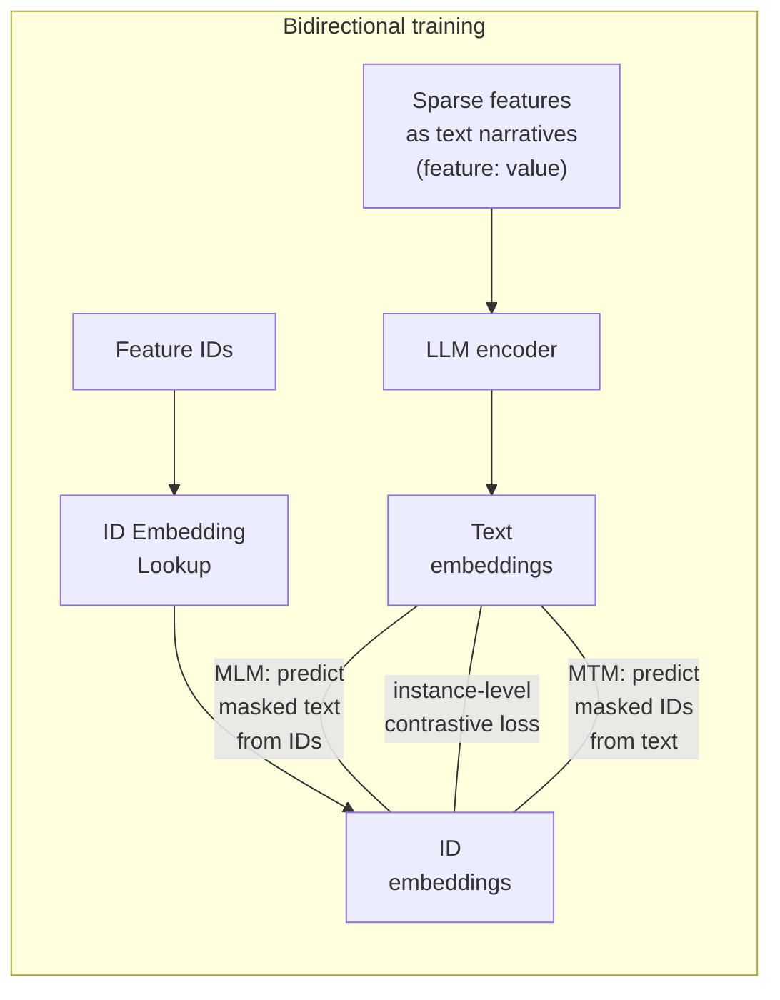

*Everything that breaks when you put a 450-million-row lookup table at the center of your model, and how the industry fixes it.*

---

## What Sparse Features Are and Why They Matter

In XGBoost-era recommendation, you'd never feed a raw product ID into a model. Instead, you'd aggregate: "user viewed 3 sports posts in 24 hours." Maybe you'd add breakdowns by category. But this loses *memorization*. Knowing a user viewed 3 NBA official account posts is far more predictive than knowing they viewed 3 sports posts. And even within basketball, a user's reaction to NBA vs. CBA content can be very different.

The embedding lookup table changed this. Raw entity IDs go in, dense vectors come out, and the table gets updated via backprop alongside the rest of the model. The embedding learns to represent each entity in the context of the prediction task, capturing collaborative signal that no amount of manual feature engineering could replicate.

This is the same philosophical shift driving LLMs: deprecate hand-crafted structure, feed less-processed inputs, let more compute learn from the data directly.

The catch is that this simple abstraction, a big matrix of learned vectors, creates a set of interrelated challenges at production scale. The rest of this post covers four of them: making the table fit in memory, making training stable, making embeddings generalizable beyond their training context, and making the table servable and fresh at inference time. These aren't sequential stages. They're dimensions of the same problem that teams work on simultaneously.

---

## Making the Table Fit: The Cardinality Problem

If you have 1 billion unique ad IDs but can only afford a table with 10 million rows, you apply the **hashing trick**: `index = hash(id) % num_rows`. This means roughly 100 different IDs map to the same vector. The collisions are random and destructive. A luxury handbag ad and a truck parts ad might share an embedding, and the vector gets dominated by whichever ID has more training samples. Tail entities get drowned out.

### Compositional Embeddings (QR Trick)

Meta's DLRM team (Shi et al., 2019) introduced compositional embeddings to get unique representations from smaller tables. For a category index $i$, you create two smaller tables and look up:

- **Quotient table**: row $\lfloor i / M \rfloor$
- **Remainder table**: row $i \bmod M$

Then combine via element-wise multiplication. If the original table needed $N$ rows, you choose $M \approx \sqrt{N}$, giving two tables of size $\sqrt{N}$ each. The total parameter count drops from $O(N \cdot D)$ to $O(2\sqrt{N} \cdot D)$ while still producing a unique embedding per ID, because no two IDs share the same (quotient, remainder) pair.

Empirically, the QR trick achieves roughly 4× model size reduction with meaningfully less quality degradation than naive hashing on DLRM benchmarks. The idea generalizes to $k$ complementary partitions, reducing memory to $O(k \cdot N^{1/k} \cdot D)$, though in practice 2 partitions capture most of the benefit.

### Adaptive Allocation (CAFE)

The QR trick treats all IDs equally, but real feature distributions follow a power law. A tiny fraction of IDs account for most of the training signal. CAFE (Zhang et al., SIGMOD 2024) exploits this directly: hot features get unique embeddings, while the long tail shares embeddings via hashing.

The mechanism is HotSketch, a lightweight streaming sketch data structure that tracks feature importance in real time with bounded error. Hot features get promoted to their own embedding vector; everything else falls back to a shared hash embedding pool. This achieves 10,000× compression on Criteo with only modest AUC loss, dramatically better than uniform hashing or QR at extreme compression ratios. The insight is simple: if 1% of IDs generate 80% of your signal, spend your memory budget on them and let the rest share.

### Semantic IDs

Google (RecSys 2024) reframed the problem entirely: instead of compressing a random ID space, learn a meaningful index structure so that similar entities share prefixes.

They use RQ-VAE (Residual Quantized Variational Autoencoder) to encode content embeddings into a sequence of codebook indices. The concatenation of these indices *is* the Semantic ID. Entities with similar content get similar prefixes in their Semantic ID, while the later codebook positions preserve fine-grained distinctions. During downstream training, these Semantic IDs can be broken into n-grams or tokenized via SentencePiece and looked up in standard embedding tables, with 1-to-1 mapping instead of hashing, since the codebook vocabulary is controlled.

This converts the cardinality problem from "compress a random ID space" into "learn a structured representation space."

### Interview angle

Interviewers often ask "how would you handle a feature with 1 billion unique values?" The progression here is the answer: naive hashing (lossy) → QR trick (unique but uniform) → CAFE (adaptive to frequency) → Semantic IDs (structured by content). Know the tradeoffs: QR is simple and deterministic, CAFE needs a streaming sketch, Semantic IDs require a separate RQ-VAE training pipeline.

---

## Making Training Stable: The One-Epoch Problem

This is arguably the most interview-relevant challenge with ID embeddings, and under-discussed relative to its practical importance.

### What happens

You train your model, and test performance craters at the start of epoch 2. This is the **one-epoch phenomenon**. The model overfits after a single pass through the data.

Feature IDs follow a power-law distribution. Head IDs (popular users, viral content) have millions of training samples. Tail IDs (new users, niche items) might have single-digit samples. After one epoch, the tail embeddings have essentially memorized their few examples. They have more free parameters (the full embedding dimension) than training signal. A second pass reinforces this memorization and destroys generalization.

Zhang et al. (CIKM 2022) showed this is specific to deep models with embedding layers plus MLPs, not simpler models like logistic regression. The culprits are feature sparsity, fast-converging optimizers like Adam, and the interaction between embeddings and deep layers that amplifies memorization.

### Two-stage pre-training

Hsu et al. (Pinterest, RecSys 2024) address this by separating embedding learning from the downstream model. In stage 1, ID embeddings are pre-trained in a minimal dot-product model with contrastive loss. Two properties of this setup resist overfitting: the minimal model has far less capacity than the full ranking model, so embeddings can't memorize complex patterns from sparse tail examples. And because the model is minimal and cheap per-example, you can afford to train on 10× more engagement data from multiple surfaces, giving much better coverage of tail IDs.

In stage 2, these pre-trained embeddings are plugged into the full ranking model and fine-tuned.

### Frequency-adaptive learning rates

A companion Pinterest paper (KDD 2025) takes a lighter-weight approach: apply a frequency-adaptive learning rate that selectively reduces the learning rate for infrequent embedding rows. Head IDs train at the normal rate; tail IDs get dampened.

An interesting practical finding from this work: both frequency-adaptive LR and embedding re-initialization (MEDA, which resets embedding weights to their initial values at the start of each epoch so the model can't build on memorized patterns) outperform multi-epoch baselines on a fixed validation set.

However, in their continual training setup (where the model receives fresh data daily), the baseline catches up after several days. This doesn't mean the one-epoch problem goes away. The baseline is getting *new* data, not re-training on the same data. What it suggests is that in production systems with continuous fresh data, the practical impact of multi-epoch overfitting may be smaller because the model keeps moving forward rather than revisiting old examples.

### Interview angle

This is the go-to question when interviewers probe whether you understand training dynamics of sparse features, not just architecture. Key points: the problem is caused by the power-law distribution of IDs (not model size), two-stage pre-training is the cleanest fix (low-capacity model + broad data coverage), and in online/continual training the problem doesn't directly apply since you're not revisiting old data (though the underlying tail-ID sparsity challenge remains). Practical mitigations include frequency filtering (don't allocate embeddings for IDs below a count threshold), regularization, and per-epoch embedding re-initialization.

---

## Making Embeddings Generalizable: Transfer and Enrichment

ID embeddings capture collaborative signal: patterns learned from user behavior data. This has three limitations. First, embeddings trained for one model don't transfer well to another, because the embedding space is co-adapted with the original model's dense layers. Second, two semantically similar entities (a pizza restaurant in Sunnyvale and one in Beijing) can get completely different embeddings if their user populations differ. For cold-start entities with no interaction history, the embedding is random noise. Third, if your model already has strong pretrained entity representations, adding more embedding tables trained on the same type of signal may add nothing.

### Transfer: Reusing Embeddings Across Models and Domains

#### Three-tier hierarchy (Meituan)

Meituan (2024) designed a three-tier hierarchy for embedding reuse across domains. For a given entity $j$:

**Tiny Pre-trained Model (TPM).** Simple architecture, fewer features, trained on 6 months of natural domain data. Refreshed monthly, with each month's embedding snapshot stored. The last 3 monthly snapshots are retained for downstream use, giving a sequence of embeddings for entity $j$:

$$\mathbf{e}_j^{(1)},\ \mathbf{e}_j^{(2)},\ \mathbf{e}_j^{(3)} \in \mathbb{R}^d$$

**Complete Pre-trained Model (CPM).** Same architecture and features as the target model, trained on 1 month of source domain data. For each entity, the 3 TPM snapshots are stacked and passed through a self-attention layer (the paper references Vaswani et al. but does not provide full architectural details for this component). The attended outputs are then mean-pooled into a single vector. We can reconstruct the likely mechanism using standard self-attention:

$$\mathbf{H}_j = \begin{bmatrix} \mathbf{e}_j^{(1)} \\ \mathbf{e}_j^{(2)} \\ \mathbf{e}_j^{(3)} \end{bmatrix} \in \mathbb{R}^{3 \times d}$$

$$\mathbf{A}_j = \text{SelfAttention}(\mathbf{H}_j) \in \mathbb{R}^{3 \times d}$$

$$\bar{\mathbf{e}}_j = \frac{1}{3} \sum_{t=1}^{3} \mathbf{A}_{j}^{(t)} \in \mathbb{R}^d$$

The self-attention weights are trained jointly with the rest of the CPM during source domain training. $\bar{\mathbf{e}}_j$ initializes or augments entity $j$'s embedding in the CPM, so the CPM's learned parameters, both embeddings $\mathbf{E}_{\text{CPM}}$ and dense weights $\mathbf{W}_{\text{CPM}}$, are aligned to the target model's architecture. After training, the self-attention parameters are frozen and the 3 embeddings are merged into one table using the fixed attention weights to reduce serving cost. Refreshed weekly.

**Target Domain Model.** Initialized directly from CPM parameters:

$$\theta_{\text{target}} \leftarrow \{\mathbf{E}_{\text{CPM}},\ \mathbf{W}_{\text{CPM}}\} \quad \text{(excluding batch norm, which is domain-specific)}$$

Then incrementally trained on recent days of target domain data. Refreshed daily.

The hierarchy separates temporal concerns: TPM handles long memory (months), CPM handles domain adaptation (weeks), target model handles recency (days). The tradeoff is MLOps complexity, with three training pipelines and dependency chains across refresh schedules.

### Enrichment: Adding Signal Your ID Embeddings Don't Have

Collaborative ID embeddings capture user behavior patterns but are useless for cold-start entities and don't generalize across semantically similar items. Enrichment adds signal from a different source to fill these gaps. The approaches below differ in *where* that signal comes from (text via LLMs, or graph structure via KGE) and *what problem* they primarily address.

#### Via LLMs

The mechanism: feed entity text (names, descriptions, metadata) through an LLM, extract a hidden state from the model's internals (typically the last token's representation), project it through a trainable MLP, and use contrastive loss to align the result with the collaborative ID embedding for the same entity. Three recent papers illustrate different points in this design space:

##### LARR (Meituan, 2024)

Best when entities have rich text metadata and you need real-time scene understanding.

**Training:**



**Inference:**


##### FLARE (Google, 2024)

Best when long-tail entity quality is the bottleneck. A tail entity like "Coding Monkey Pizza" that has few interactions but a similar text description to "Pizza Hut" gets pulled toward Pizza Hut's well-trained collaborative embedding.



The masked ID prediction objective (mask some items in the sequence, predict from context) forces the model to use text embeddings to fill in for missing IDs, which is how tail entities inherit signal from semantically similar head entities.

##### FLIP (Huawei, RecSys 2024)

Best when you want an architecture-agnostic framework that doesn't depend on specific entity types.



After alignment, the combined embeddings fine-tune for downstream tasks via a two-tower architecture.

Due to LLM inference cost, semantic embeddings are typically pre-computed across all three approaches, which creates its own infrastructure challenges for feature serving and freshness.

#### Via Knowledge Graph Embeddings (Pinterest)

The LLM approaches above address cold-start and long-tail entities. Pinterest's multi-faceted pretraining (Su et al., 2025) solved a different problem: making large embedding tables useful when you already have strong entity representations.

When they first tried adding large ID embedding tables to their ads ranking models, the result was neutral. The tables didn't help because Pinterest already had high-quality pretrained embeddings from GraphSage, PinnerFormer, and ItemSage that captured similar collaborative signal. At companies without such strong existing representations, large embedding tables trained from scratch work fine.

Their solution was to pretrain the embedding tables with information from a *different methodology* than their existing embeddings used. They combined two pretraining signals. The first was user-pin contrastive learning on long-window engagement data, capturing direct interaction patterns independently of other features.

The second was Knowledge Graph Embeddings (KGE), specifically a variant of TransR. This is not a GNN. There's no message passing or neighborhood aggregation. The core idea in PyTorch:

```python
# Each entity (user, pin, ad) gets an embedding vector
entity_emb = nn.Embedding(num_entities, entity_dim)    # e.g., entity_dim=128

# Each relation type gets a projection matrix and translation vector
# Relations: "clicked", "purchased", "saved", etc.
rel_proj = nn.Embedding(num_relations, entity_dim * rel_dim)  # flattened projection matrix
rel_trans = nn.Embedding(num_relations, rel_dim)               # translation vector

# For a triple (user, clicked, pin):
h = entity_emb(user_id)                            # (entity_dim,)
t = entity_emb(pin_id)                             # (entity_dim,)
M_r = rel_proj(rel_id).view(entity_dim, rel_dim)   # (entity_dim, rel_dim)
r = rel_trans(rel_id)                               # (rel_dim,)

# Project head and tail into relation-specific space
h_r = torch.einsum('i,ij->j', h, M_r)   # (rel_dim,)
t_r = torch.einsum('i,ij->j', t, M_r)   # (rel_dim,)

# Score: distance should be small for real triples, large for fake ones
score = torch.norm(h_r + r - t_r, p=2)
```

The key difference from GCN-based embeddings like GraphSage: GraphSage learns an entity's embedding by aggregating features from its neighbors in the graph, hop by hop. TransR learns embeddings by scoring (head, relation, tail) triples directly. Each relation type has its own projection matrix $\mathbf{M}_r$, so the same entity can have different representations depending on what relationship is being evaluated. Pinterest built billions of such triples from click and conversion logs and trained entity embeddings on this objective.

The two pretraining methods provided orthogonal gains: contrastive learning contributed +0.03% AUC, and KGE added another +0.06% on top.

### Interview angle

The standard question here is "how would you handle cold-start entities?" or "your embedding for a new product is random. What do you do?" The answer ladder: (1) fall back to content features or text embeddings from an LLM, (2) align semantic and collaborative spaces so new entities inherit signal from semantically similar established entities, (3) for cross-domain transfer, bootstrap from a hierarchical pre-trained embedding system. Know that contrastive learning is the alignment workhorse across all these approaches.

---

## Making the Table Servable: Systems for Scale

The challenges above are primarily about what the embeddings represent and how they're trained. This section is about the infrastructure to make them work at scale, both during training and at serving time.

### Sharding for training

Meta's TorchRec library is the standard toolkit for distributed embedding table training. The key sharding strategies and when each makes sense:

**Table-wise** places an entire table on one GPU. Simplest option, works when individual tables fit in GPU memory. The cost is communication. Other GPUs need to request lookups from the owning GPU.

**Row-wise** splits a table's rows evenly across all GPUs. Use this when a single table is too large for one GPU. Each GPU handles lookups for its shard of the row space.

**Column-wise** splits the embedding dimension across GPUs (rare in practice since most embedding dimensions are 64-256, too small to justify this).

**Table-wise-row-wise** is a hybrid optimized for multi-GPU nodes with fast interconnects like NVLink. The table is assigned to one host, then row-split across GPUs within that host.

TorchRec's Planner automatically evaluates memory constraints, compute requirements, and hardware topology to select the optimal strategy per table. Pinterest uses TorchRec to shard their 450M-row tables across 8 GPUs during training.

### CPU-GPU hybrid serving (Pinterest)

Training and serving face different constraints. Pinterest's production ads models run on instances with 24GB GPU memory and 64GB CPU memory. Neither can hold the full embedding table. Their solution separates the embedding tables from the upper model:

Large embedding tables live on external CPU clusters, compressed with INT4 quantization (roughly 4× memory reduction). The upper model (dense layers) stays on the GPU. The embedding table is still part of the model artifact, just hosted on different hardware.

Why not use a feature store instead? The problem is deployment atomicity. In a feature store approach, embeddings are a separate system from the model. When you deploy a new model version with updated embedding weights, you need to update billions of rows in the feature store AND swap the model simultaneously. If the model goes to v2 while the feature store is still propagating v1 embeddings, you get a silent version mismatch. The embeddings and dense weights were trained together, so using mismatched versions degrades quality with no error signal. In the CPU-GPU hybrid approach, the CPU embedding table and GPU upper model deploy together as one atomic unit via a version-consistent deployment protocol, eliminating this risk.

The result: embedding table scaling is decoupled from GPU capacity entirely. Communication overhead between CPU embedding fetches and GPU inference is masked by pipelining, achieving neutral end-to-end latency impact.

### Collisionless dynamic tables for online training (ByteDance Monolith)

Monolith takes a different philosophy. Instead of the fixed-size hashed tables discussed in the cardinality section, it uses a dynamically-sized collisionless hash table (via Cuckoo Hashing) as the embedding store. The table grows as new IDs arrive. No collisions, ever.

The obvious problem is unbounded memory growth. Monolith controls this with two mechanisms. Frequency filtering requires IDs to appear above a configurable threshold before an embedding is allocated. Infrequent IDs would have underfit embeddings anyway, so filtering them out doesn't hurt model quality. Expirable embeddings give each ID a TTL; after a configurable period of inactivity, the embedding is evicted. Different tables can have different expiry policies based on how sensitive the feature is to historical information.

Combined with online training that continuously processes streaming data, Monolith closes the feedback loop from user action to updated model in minutes rather than hours. In production A/B tests at ByteDance, collisionless embeddings consistently outperformed collision-based approaches (0.2–0.4% AUC gain), and online training consistently beat batch training.

### Interview angle

The systems question is usually "you have a 100GB embedding table and a 24GB GPU. How do you serve this?" The answer framework: for training, shard with TorchRec (know the sharding modes); for serving, CPU-GPU hybrid with quantization; for dynamic/streaming settings, collisionless tables with frequency filtering and TTL. Know the version consistency problem. It's the subtle failure mode interviewers look for.

---

## Looking Forward

A few trends worth tracking:

The one-epoch problem is specific to batch training where you revisit the same data. As online training and continuous data pipelines become standard, teams encounter it less in practice. But interviewers still ask about it frequently, so know the mechanics.

Using LLM outputs as additional input to traditional recommendation models is becoming mainstream, but inference cost keeps semantic embeddings in pre-computed territory. Advances in LLM distillation and efficient inference could change this. Real-time semantic embedding extraction would collapse the pre-compute infrastructure entirely.

The boundary between the embedding table and the model is blurring. Semantic IDs already treat the ID space as learned structure rather than arbitrary indexing. As embeddings take on more responsibility for memory and context, and dense layers focus more on reasoning and combination, the embedding table starts to look less like a lookup and more like a compressed knowledge store.

---

## References

1. [Compositional Embeddings Using Complementary Partitions for Memory-Efficient Recommendation Systems](https://arxiv.org/abs/1909.02107), Shi et al., 2019
2. [Towards Understanding the Overfitting Phenomenon of Deep Click-Through Rate Models](https://arxiv.org/abs/2209.06053), Zhang et al., CIKM 2022
3. [Monolith: Real Time Recommendation System with Collisionless Embedding Table](https://arxiv.org/abs/2209.07663), Liu et al., ORSUM@RecSys 2022
4. [CAFE: Towards Compact, Adaptive, and Fast Embedding for Large-scale Recommendation Models](https://arxiv.org/abs/2312.03256), Zhang et al., SIGMOD 2024
5. [Taming the One-Epoch Phenomenon in Online Recommendation System by Two-stage Contrastive ID Pre-training](https://arxiv.org/abs/2508.18700), Hsu et al., RecSys 2024
6. [Efficient Transfer Learning Framework for Cross-Domain Click-Through Rate Prediction](https://arxiv.org/abs/2408.16238), Meituan, 2024
7. [LARR: Large Language Model Aided Real-time Scene Recommendation with Semantic Understanding](https://arxiv.org/abs/2408.11523), Meituan, 2024
8. [FLARE: Fusing Language Models and Collaborative Architectures for Recommender Enhancement](https://arxiv.org/abs/2409.11699), Google, 2024
9. [FLIP: Fine-grained Alignment between ID-based Models and Pretrained Language Models for CTR Prediction](https://dl.acm.org/doi/10.1145/3640457.3688106), Huawei, RecSys 2024
10. [Better Generalization with Semantic IDs: A Case Study in Ranking for Recommendations](https://dl.acm.org/doi/10.1145/3640457.3688190), Google, RecSys 2024
11. [Multi-Faceted Large Embedding Tables for Pinterest Ads Ranking](https://arxiv.org/abs/2508.05700), Su et al., 2025
12. [The Evolution of Embedding Table Optimization and Multi-Epoch Training in Pinterest Ads Conversion](https://arxiv.org/abs/2505.05605), Pinterest, 2025
13. [Trend of Sparse Features in Recommendation System](https://pyemma.github.io/Machine-Learning-System-Design-Sparse-Features/), Coding Monkey blog, 2024

---

## Citation

```bibtex
@misc{naskovai2026idembtables,
  author = {naskovai},
  title  = {Large ID Embedding Tables in Recommendation Systems},
  year   = {2026},
  url    = {https://naskovai.github.io/posts/large-id-embeddings-in-recsys/}
}
```
