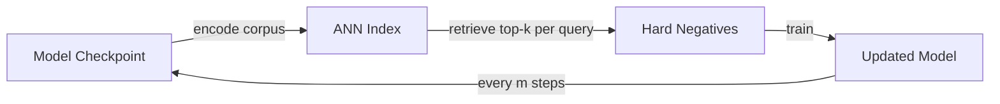
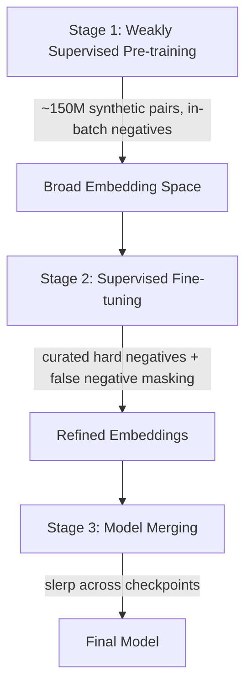

You have a billion items. A user issues a query. You need to find the relevant ones, fast.

The standard solution is a two-tower network (Covington et al., 2016): one tower encodes the query, the other encodes items, and dot-product similarity becomes your relevance score. At serving time, you precompute all item embeddings, build an ANN index, and retrieve the top-k nearest neighbors in milliseconds.

Training this model means learning embeddings such that relevant (query, item) pairs land close together and irrelevant ones land far apart. Formally, we want to maximize:

$$p(y_i \mid x_i; \theta) = \frac{e^{s(x_i, y_i)}}{\sum_{j \in [M]} e^{s(x_i, y_j)}}$$

where $s(x_i, y_j) = \langle u(x_i, \theta), v(y_j, \theta) \rangle$ is the dot product of the query and item embeddings, and $M$ is the full corpus.

The denominator is the problem. You cannot sum over a billion items every training step (the same bottleneck that drove candidate sampling in neural machine translation, Jean et al., 2014). Negative sampling, choosing a small subset of negatives to approximate that denominator, is how every production retrieval system actually trains.

This post traces the evolution of how we pick those negatives. Each advance solved one problem and exposed the next, until the modern pipeline assembled all the pieces into a working system.

---

## 1. Loss Functions

Before we talk about *which* negatives to use, we need to understand *what we're optimizing*. The loss function determines how much each negative contributes to learning, and the choice of loss is tightly coupled to the choice of negatives.

### InfoNCE

The workhorse of modern contrastive learning (Oord et al., 2018). Given a query $x_i$, its positive item $y_i$, and a set of negatives $\{y_j\}_{j \neq i}$, the loss is:

$$\mathcal{L}_{\text{InfoNCE}} = -\log \frac{e^{s(x_i, y_i) / \tau}}{\sum_{j \in B} e^{s(x_i, y_j) / \tau}}$$

where $B$ is the batch and $\tau$ is a temperature parameter. This is softmax cross-entropy: "given this query, classify the correct item out of all items in the batch."

**Temperature** controls how much the model cares about hard negatives vs. easy ones. The gradient of InfoNCE with respect to the score $s(x_i, y_j)$ for a negative $y_j$ is proportional to:

$$\frac{\partial \mathcal{L}}{\partial s(x_i, y_j)} \propto \frac{e^{s(x_i, y_j) / \tau}}{\sum_{k} e^{s(x_i, y_k) / \tau}}$$

This is a softmax over negatives. Low $\tau$ sharpens this distribution. The hardest negative (highest similarity) dominates the gradient, and easy negatives contribute almost nothing. High $\tau$ flattens it, and all negatives contribute more equally.

This means temperature is an *implicit hard negative miner*. Lowering $\tau$ has a similar effect to explicitly selecting harder negatives, without changing the sampling strategy.

### Hinge / Triplet Loss

The historical predecessor, popularized by FaceNet (Schroff et al., 2015). Given an anchor $a$, positive $p$, and negative $n$:

$$\mathcal{L}_{\text{triplet}} = \left[\, d(a, p) - d(a, n) + m \,\right]_+$$

where $d(\cdot, \cdot)$ is a distance function and $m$ is the margin. The hinge $[\cdot]_+$ means the loss is zero when the negative is already farther than the positive by at least the margin.

The **three-part formulation** adds absolute constraints on top of the relative margin:

1. **Positive collapse prevention**: $d(a, p) < \alpha$. The positive must be within some absolute distance, preventing the trivial solution where all embeddings spread infinitely apart
2. **Negative floor**: $d(a, n) > \beta$. Easy negatives must be at least some absolute distance away, ensuring the embedding space has actual separation
3. **Relative margin**: $d(a, p) - d(a, n) + m < 0$. The standard triplet constraint

Together, these three constraints give you geometric control over where embeddings *actually land*, not just their relative ordering. The basic triplet loss only enforces ordering. It's happy if all your embeddings are crammed into a tiny ball, as long as positives are marginally closer than negatives. The three-part version prevents this degenerate geometry.

### Why InfoNCE Won

The triplet loss processes one triplet at a time: one anchor, one positive, one negative. Each training step produces one learning signal. Sohn (2016) identified this as a fundamental bottleneck: the model only interacts with one negative class per update, leading to slow convergence.

InfoNCE over a batch of size $B$ gives each query $B - 1$ negative comparisons simultaneously. (InfoNCE is essentially Sohn's N-pair loss with a temperature parameter.) Each training step produces $B - 1$ learning signals per query. With a batch size of 2048, that's 2047 negative comparisons per query per step. You can of course process multiple triplets per batch, but each triplet's gradient is computed independently. InfoNCE couples all negatives into a single softmax, meaning they compete against each other for probability mass, which produces a richer gradient per step.

This isn't just an efficiency argument. It changes what the model can learn per step. Triplet loss must decide: do I use a hard negative (informative but unstable) or an easy one (stable but uninformative)? InfoNCE sidesteps this by using *all* the negatives in the batch, weighted by the softmax (controlled by temperature). Hard negatives naturally get more gradient weight, easy ones get less, and you don't have to choose.

The practical consequence: triplet loss is extremely sensitive to mining strategy. Pick bad triplets and training stalls. Pick triplets that are too hard and training collapses. InfoNCE is more forgiving because the batch provides a natural mixture of difficulties.

This is why nearly every modern retrieval system (DPR, ANCE, Qwen3, the Google two-tower papers) uses InfoNCE or a close variant. DPR (Karpukhin et al., 2020) was the breakthrough that made dense retrieval competitive with sparse retrieval for open-domain question answering, and its recipe was simple: BERT dual-encoder + InfoNCE with in-batch negatives + one BM25 hard negative per query.

---

## 2. Sampling Easy Negatives

Xu et al. (2022) organize negative sampling approaches into a taxonomy along two axes: static vs. dynamic, and data-independent vs. data-dependent. The approaches in this section are all static and data-independent. They're simple, but they're where every system starts.

### Random Negative Sampling (RNS)

The simplest approach: draw items uniformly from the corpus. For each $(x_i, y_i)$ pair, sample $K$ random items as negatives.

This works as a baseline because in a billion-item corpus, a random item is almost certainly irrelevant to any given query. The model learns to separate obviously unrelated items, like "this sneaker query has nothing to do with this vacuum cleaner listing."

The problem is that random negatives are *too* easy. After a few epochs, the model already scores them near zero. The gradients become tiny, and training stalls. You're spending compute on examples the model already handles perfectly.

Additionally, sampling from the full corpus is itself expensive at scale. You need to maintain an index over all items just for sampling.

### Batch Negative Sampling (BNS)

The key insight: other items in the current mini-batch are free negatives. For each query $x_i$ with positive item $y_i$, treat every other item $y_j$ (where $j \neq i$) in the batch as a negative:

$$\mathcal{L} = -\log \frac{e^{s(x_i, y_i) / \tau}}{\sum_{j \in B} e^{s(x_i, y_j) / \tau}}$$

This is exactly the InfoNCE loss from above, with the batch $B$ replacing the full corpus $M$ in the denominator. No extra sampling, no extra encoding. The items are already embedded as part of the forward pass. With batch size 2048, you get 2047 negatives for free.

This is elegant but has a bias problem. Items appear in batches proportional to their frequency in the training data. Popular items, the Nikes, the iPhones, show up in many batches and get used as negatives far more often than long-tail items. The model over-penalizes popular items (pushing them away from too many queries) and under-penalizes rare items (barely ever seeing them as negatives). At serving time, this manifests as the model retrieving strange long-tail items while suppressing popular ones.

**logQ correction** (Yi et al., 2019) fixes this by adjusting the logit:

$$s^c(x_i, y_j) = s(x_i, y_j) - \log Q(j)$$

where $Q(j) = \frac{\text{count}(j)}{\sum_k \text{count}(k)}$ is the item's sampling probability. Popular items get their scores reduced, compensating for the over-representation in batches. This correction is theoretically grounded in importance sampling. It adjusts for the mismatch between the batch sampling distribution and the uniform distribution you'd ideally sample from.

### Mixed Negative Sampling (MNS)

Google's solution (Yang et al., 2020): combine batch negatives with randomly sampled negatives. For a batch $B$, additionally draw $B'$ items uniformly from the corpus:

$$\mathcal{L} = -\log \frac{e^{s(x_i, y_i) / \tau}}{\sum_{j \in B + B'} e^{s(x_i, y_j) / \tau}}$$

The random negatives dilute the popularity bias of batch negatives, since they're drawn uniformly regardless of frequency. The hyperparameter $B'$ controls the trade-off: too large and you're back to mostly uninformative random negatives; too small and the popularity bias persists.

MNS became the standard baseline at Google and is used across many production systems. It's the "good enough" default before you start doing anything clever with hard negatives.

### Interlude: When the Problem Isn't the Negatives

Before we move to harder sampling strategies, it's worth noting that JD.com got significant gains by changing *the other side of the equation* entirely, not which negatives you pick, but how you score against them.

Their system, **DPSR** (Deep Personalized and Semantic Retrieval, Zhang et al., SIGIR 2020), keeps standard batch + random negatives but modifies the query tower to output $K$ separate embeddings instead of one. At training time, the score is a weighted sum of $K$ dot products, one per query head:

$$s(x, y) = \sum_{k=1}^{K} \alpha_k \cdot \langle u_k(x, \theta), v(y, \theta) \rangle$$

The weights $\alpha_k = \text{softmax}(e_k^\top g / \beta)$ use the same dot products that they're weighting. Each head $k$ produces a raw dot product $z_k = e_k^\top g$ with the item embedding $g$. Those $z_k$ values serve double duty: they're both the scores being aggregated AND the inputs to the softmax that determines the aggregation weights. The final score is $s = \sum_k \alpha_k \cdot z_k$.

This makes the whole thing a soft-max selection over heads. The temperature $\beta$ controls how selective it is: as $\beta \to 0$, the highest $z_k$ gets all the weight, so $s \approx \max_k(z_k)$ (the paper notes this explicitly). As $\beta \to \infty$, weights become uniform and $s = \text{mean}(z_k)$. In practice, the model learns to route: for an iPhone listing, the electronics head's dot product is highest, so it dominates the score. For a fruit listing, the food head dominates.

This scalar score is what goes into a standard hinge loss:

$$\mathcal{L} = \sum_{(q_i, s_i^+, N_i)} \sum_{s_j^- \in N_i} \max\left(0, \;\delta - s(q_i, s_i^+) + s(q_i, s_j^-)\right)$$

So the multi-head mechanism and the loss function are cleanly separated. The heads produce K dot products, the soft-max collapses them into one score, and the hinge loss operates on that score the same way it would for a single-head model.

The item tower is unchanged, one embedding per item. **At serving time**, the weighted scoring function is not used. The paper states explicitly that what it calls the "attention loss" is applied only during offline training. Instead, each query head runs a separate ANN lookup against the same item index, the results are unioned, and items are re-ranked by their dot product with one of the heads. This is simpler than what you might expect. The weighted sum $\sum \alpha_k \langle u_k, v \rangle$ could in principle be computed at re-ranking time (since you now have both query and item embeddings), but the paper doesn't do this.

The paper's stated motivation is polysemy: "apple" could mean the fruit or the brand. But high-dimensional embeddings can represent multiple senses simultaneously via superposition, nearly orthogonal directions in the same vector (Arora et al., 2018). The more defensible explanation is simpler: multi-head is a strictly more expressive scoring function, and the paper is literally called *Deep **Personalized** and Semantic Retrieval*. Different users typing "apple" want different things, and multi-head gives the model user-conditioned intent vectors.

DPSR achieved a +10% conversion rate gain on long-tail queries. But the gains came from the scoring function, not the negative sampling. For most teams, the scoring function is a dot product and stays that way. The lever you actually pull is *which negatives the model trains on*.

---

## 3. Hard Negatives

Everything so far (random, batch, mixed) produces easy negatives. Items that are obviously irrelevant. The model separates them quickly and then has nothing to learn from.

Hard negatives are items the model finds confusing: high similarity to the query but actually irrelevant. A different John Smith when you searched for your friend. A sneaker from the wrong brand that looks similar. These are the examples that force the model to learn fine-grained distinctions.

But hard negatives are dangerous. And the story of how the field learned to use them safely is the story of modern negative sampling.

### Why Naive Hard Negatives Fail

The Facebook Search team (Huang et al., KDD 2020) learned this the hard way. When they trained their people search embedding model using only hard negatives (impressed but unclicked search results), they observed a **55% absolute recall drop** compared to random negatives.

The paper identifies the core issue as a distribution mismatch: hard negatives are items that match the query on one or more factors, but at serving time the vast majority of candidates in the index don't match the query at all. Training exclusively on hard cases makes the training distribution unrepresentative of the actual retrieval task.

They also found that using the *hardest* negatives (top-ranked non-clicks) wasn't optimal. Sampling from rank 101-500 beat the hardest negatives. The fix was hybrid sampling: random negatives as the base, with hard negatives mixed in. This kept the training distribution representative while adding fine-grained signal.


### Curriculum: Easy → Hard

Hacohen & Weinshall (2019) showed that training on easy examples first, then gradually introducing harder ones, accelerates convergence in deep networks. The model needs the easy negatives to build a reasonable embedding space before it can meaningfully learn from hard negatives. Start with hard negatives too early and the model's embedding space is random noise. The "hard" negatives are hard for the wrong reasons.

**LinkedIn's job search system** (Shen et al., KDD 2024) implemented this explicitly. Their EBR system initially failed to beat the term-matching baseline. Two changes fixed it:

First, they warmed up the model on batch negatives, standard in-batch contrastive learning. Once the model had a reasonable embedding space, they switched to online hard negative mining: using the model's own scores to select the most confusing negatives from the batch.

Second, at serving time, they deployed EBR in parallel with term-matching retrieval and used exact-match rules for navigational queries as relevance guardrails. This is hybrid search, not a training technique, but it meant the embedding model didn't need to handle every query type perfectly on its own.

### Keeping Negatives Fresh: ANCE

There's a subtler problem with hard negative mining that the Facebook and LinkedIn approaches don't fully solve: **staleness**.

Hard negatives are mined using the model's current embeddings. But training changes the embeddings every step. The negatives you mined 10 minutes ago, or even 100 steps ago, were hard for a model checkpoint that no longer exists. They might be trivially easy (or trivially hard) for the current model. You're training on stale data.

**ANCE** (Approximate nearest neighbor Negative Contrastive Estimation, Xiong et al., ICLR 2021) directly addresses this. The core mechanism:



1. Build an ANN index over the entire corpus using the model's current embeddings
2. For each query, retrieve the top-$k$ nearest items from this index. These are the model's *current* hardest negatives
3. Train on these negatives
4. Periodically re-build the ANN index with updated embeddings
5. Repeat

The critical insight is theoretical: the authors showed that uninformative (easy) negatives dominate gradient variance in standard training. Most negatives are so far from the query that their gradient contribution is essentially noise. ANCE negatives come from the top of the retrieval list. They're the items the model *currently* confuses with relevant ones, which is exactly what the model will face at test time. This resolves the distribution mismatch between training negatives (random or batch-sampled) and test-time negatives (top of the ANN index).

The "approximate" and "asynchronous" parts matter for practical implementation. You can't rebuild the ANN index every batch. It's too expensive. ANCE refreshes the index every $m$ training steps, running the index builder in parallel with training. This means negatives are always *slightly* stale, coming from a checkpoint $m$ steps behind. The paper shows this staleness is manageable: the efficiency bottleneck is in the encoding update, not in the ANN construction, and convergence is not significantly affected for reasonable refresh intervals.

ANCE boosted BERT-Siamese dense retrieval to outperform all competitive sparse and dense baselines at the time, and nearly matched the accuracy of the full BERT-reranking cascade pipeline, at 100x the speed.

### Handling False Negatives

ANCE solved the staleness problem. But by making hard negative mining *actually good*, it exposed a new enemy: **false negatives**.

A false negative is an item labeled as negative that is actually relevant. In a billion-item corpus, your labeled positives are sparse. A query might have 1-3 labeled relevant documents out of thousands that are actually relevant. When you mine hard negatives (items with high similarity to the query), you're specifically surfacing items the model thinks are relevant. Some of those *are* relevant, they just aren't in your label set.

This is worst exactly when your mining is best. Random negatives are almost never false negatives (what are the odds a random item from a billion is relevant?). But ANCE-style top-of-index negatives? Many of them are genuinely relevant documents that happen to be unlabeled. Training the model to push these away is teaching it the wrong thing.

The theoretical framing comes from Chuang et al. (2020, "Debiased Contrastive Learning"): in-batch negatives sampled from the training distribution have a nonzero probability of being false negatives proportional to the semantic overlap between the query and the negative distribution. The harder your negatives, the higher this probability.

**Qwen3 Embedding** (Zhang et al., 2025) implements the state-of-the-art solution to this problem as part of a carefully staged training pipeline.

Qwen3's training has three stages:

1. **Weakly supervised pre-training**: ~150M synthetic query-document pairs generated by Qwen3-32B, trained with contrastive loss. This builds a broad embedding space across 93 languages.
2. **Supervised fine-tuning**: ~7M labeled pairs + ~12M high-quality filtered synthetic pairs, with curated hard negatives. This is where the masking matters.
3. **Model merging**: Spherical linear interpolation (slerp) across multiple checkpoints for robustness.

During stage 2, the contrastive loss uses a modified InfoNCE with a **dynamic false-negative mask**. For a batch of $N$ queries, the normalization factor $Z_i$ for query $q_i$ is:

$$\begin{aligned}
Z_i = \; & e^{s(q_i, d_i^+)/\tau} + \sum_{k} m_{ik} \cdot e^{s(q_i, d_{i,k}^-)/\tau} + \sum_{j \neq i} m_{ij} \cdot e^{s(q_i, q_j)/\tau} \\
      + \; & \sum_{j \neq i} m_{ij} \cdot e^{s(d_i^+, d_j)/\tau} + \sum_{j \neq i} m_{ij} \cdot e^{s(q_i, d_j)/\tau}
\end{aligned}$$

The five terms are: (1) the positive, (2) curated hard negatives $d_{i,k}^-$, (3) other queries as negatives, (4) other documents compared against the positive document, (5) other documents compared against the query. The mask $m_{ij}$ is binary:

$$m_{ij} = \begin{cases} 0 & \text{if } s_{ij} > s(q_i, d_i^+) + \delta \text{ or } d_j = d_i^+ \\ 1 & \text{otherwise} \end{cases}$$

where $\delta = 0.1$ and $s_{ij}$ is the similarity score between $q_i$ and the candidate ($d_j$ or $q_j$) being evaluated.

The logic: if an in-batch item is *more similar* to the query than the labeled positive (plus a small tolerance), it's suspicious, probably a false negative. Mask it out. Don't train on it. The mask is computed per forward pass and adapts as the model's embeddings change, so no offline filtering is needed.

A crucial implementation detail: the mask $m_{ik}$ for curated hard negatives is always 1. The masking only applies to in-batch cross-sample documents, where you're uncertain about labels. Your curated hard negatives were selected deliberately, and you know they're truly negative. The in-batch items are other queries' positives that happen to be in the same batch, and you have no idea whether they're relevant to your query or not. The masking targets this uncertainty, not the curated negatives.

This distinction actually surfaced as a [bug report](https://github.com/modelscope/ms-swift/issues/6969) on the Qwen3 training framework. A user found that the masking was incorrectly being applied to their curated hard negatives, weakening the training signal. The intended behavior is masking only the uncertain in-batch items.

### The Assembled Pipeline



The complete modern negative sampling pipeline, as exemplified by Qwen3:

1. **Start easy**: large-scale pre-training with in-batch negatives on synthetic data. Build a broad embedding space.
2. **Introduce hard negatives**: supervised fine-tuning with curated hard negatives mined from the embedding space. The model is now mature enough to learn from them without collapsing.
3. **Mask false negatives**: apply dynamic per-batch masking to in-batch items that look suspiciously similar to positives. Curated hard negatives are exempt because you trust those labels.
4. **Stabilize**: model merging across checkpoints for robustness across data distributions.

Each piece solves a specific failure mode: in-batch negatives alone have popularity bias and limited informativeness. Hard negatives fix informativeness but introduce false negatives and require a mature model. Masking fixes false negatives. Curriculum staging ensures the model is ready for each level of difficulty.

Qwen3-Embedding-8B achieved #1 on the MTEB multilingual leaderboard using this pipeline. The assembled stack works.

---

## 4. Scale Engineering

The algorithms above are right. But running them at scale introduces engineering bottlenecks.

### Cross-GPU Negatives

InfoNCE benefits from larger batches, meaning more negatives per query, richer signal per step. With batch negatives, your effective negative count is bounded by what fits on one GPU.

The **all-gather trick** removes this bound: after encoding, gather all embeddings from all GPUs before computing the contrastive loss. This approach was popularized by SimCLR (Chen et al., 2020), which showed that larger batch sizes directly improve contrastive learning quality. If you have 8 GPUs with batch size 256 each, your effective batch size for the loss computation is 2048. Each query sees 2047 negatives.

Implementation is a single `torch.distributed.all_gather` call on the embedding tensors. The forward passes are still local. Each GPU encodes its own shard of the batch. Only the embeddings (not the inputs or activations) are communicated. This keeps the communication overhead small relative to the compute.

The one subtlety: gradients. After all-gather, only the embeddings from the local GPU need gradients flowing back through the encoder. The gathered embeddings from other GPUs are treated as constants for the backward pass on each GPU. Without this, you'd need to backpropagate through every GPU's encoder for every example, which defeats the purpose of data parallelism.

### GradCache

Even with distributed training, you sometimes want a batch size larger than what fits in memory across all your GPUs. Naive gradient accumulation, computing loss on sub-batches and summing the gradients, doesn't work for InfoNCE because the loss *couples* all examples in the batch. A sub-batch of 64 gives you 63 negatives per query, not the 2047 you wanted.

**GradCache** (Gao et al., 2021) solves this by decoupling the encoder backward pass from the batch size. The mechanism:

1. **First forward pass**: encode all examples in sub-batches, collecting all embeddings. Detach them from the computation graph, with no gradients stored.
2. **Loss computation**: compute InfoNCE over *all* the collected embeddings as if they were one giant batch. Backpropagate through the loss to get gradients with respect to the embeddings.
3. **Second forward pass**: re-encode each sub-batch (with gradients enabled this time), and use the cached embedding gradients from step 2 to propagate into the encoder weights.

The result: memory usage is roughly constant regardless of effective batch size (bounded by the largest sub-batch), while the loss sees the full batch. The cost is ~20% additional runtime from the two forward passes.

GradCache has been integrated into DPR and is used in Qwen3-VL-Embedding's training pipeline. It's the standard answer to "how do you get large effective batch sizes for contrastive learning under memory constraints."

---

## References

1. Meng, Y. (2024). [Negative Sampling for Learning Two-Tower Networks](https://www.yuan-meng.com/posts/negative_sampling/). yuan-meng.com.
2. Oord, A. van den, Li, Y., & Vinyals, O. (2018). [Representation Learning with Contrastive Predictive Coding](https://arxiv.org/abs/1807.03748). arXiv.
3. Schroff, F., Kalenichenko, D., & Philbin, J. (2015). [FaceNet: A Unified Embedding for Face Recognition and Clustering](https://arxiv.org/abs/1503.03832). CVPR.
4. Yi, X., Yang, J., Hong, L., et al. (2019). [Sampling-Bias-Corrected Neural Modeling for Large Corpus Item Recommendations](https://research.google/pubs/sampling-bias-corrected-neural-modeling-for-large-corpus-item-recommendations/). RecSys.
5. Yang, J., Yi, X., Zhiyuan Cheng, D., et al. (2020). [Mixed Negative Sampling for Learning Two-Tower Neural Networks in Recommendations](https://research.google/pubs/mixed-negative-sampling-for-learning-two-tower-neural-networks-in-recommendations/). WWW.
6. Zhang, H., et al. (2020). [Towards Personalized and Semantic Retrieval: An End-to-End Solution for E-commerce Search via Embedding Learning](https://dl.acm.org/doi/abs/10.1145/3397271.3401446). SIGIR.
7. Arora, S., Li, Y., Liang, Y., Ma, T., & Risteski, A. (2018). [Linear Algebraic Structure of Word Senses, with Applications to Polysemy](https://arxiv.org/abs/1601.03764). TACL.
8. Huang, J.-T., et al. (2020). [Embedding-based Retrieval in Facebook Search](https://dl.acm.org/doi/abs/10.1145/3394486.3403305). KDD.
9. Shen, Y., et al. (2024). [Learning to Retrieve for Job Matching](https://arxiv.org/abs/2402.13435). KDD.
10. Hacohen, G. & Weinshall, D. (2019). [On The Power of Curriculum Learning in Training Deep Networks](https://arxiv.org/abs/1904.03626). ICML.
11. Xiong, L., et al. (2021). [Approximate Nearest Neighbor Negative Contrastive Learning for Dense Text Retrieval](https://arxiv.org/abs/2007.00808). ICLR.
12. Karpukhin, V., et al. (2020). [Dense Passage Retrieval for Open-Domain Question Answering](https://arxiv.org/abs/2004.04906). EMNLP.
13. Chuang, C.-Y., et al. (2020). [Debiased Contrastive Learning](https://arxiv.org/abs/2007.00224). NeurIPS.
14. Zhang, Y., et al. (2025). [Qwen3 Embedding: Advancing Text Embedding and Reranking Through Foundation Models](https://arxiv.org/abs/2506.05176). arXiv.
15. Gao, L., Zhang, Y., Han, J., & Callan, J. (2021). [Scaling Deep Contrastive Learning Batch Size under Memory Limited Setup](https://arxiv.org/abs/2101.06983). RepL4NLP.
16. Chen, T., Kornblith, S., Norouzi, M., & Hinton, G. (2020). [A Simple Framework for Contrastive Learning of Visual Representations (SimCLR)](https://arxiv.org/abs/2002.05709). ICML.
17. Covington, P., Adams, J., & Sargin, E. (2016). [Deep Neural Networks for YouTube Recommendations](https://research.google/pubs/deep-neural-networks-for-youtube-recommendations/). RecSys.
18. Xu, Z., et al. (2022). [Negative Sampling for Contrastive Representation Learning: A Review](https://arxiv.org/abs/2206.00212). arXiv.
19. Jean, S., Cho, K., Memisevic, R., & Bengio, Y. (2014). [On Using Very Large Target Vocabulary for Neural Machine Translation](https://arxiv.org/abs/1412.2007). arXiv.
20. Sohn, K. (2016). [Improved Deep Metric Learning with Multi-class N-pair Loss Objective](https://papers.nips.cc/paper/6200-improved-deep-metric-learning-with-multi-class-n-pair-loss-objective). NeurIPS.

---

## Citation

```bibtex
@misc{naskovai2026negativesampling,
  author = {naskovai},
  title  = {Negative Sampling for Embedding-Based Retrieval: An Overview},
  year   = {2026},
  url    = {https://naskovai.github.io/posts/negative-sampling-ebr-overview/}
}
```
